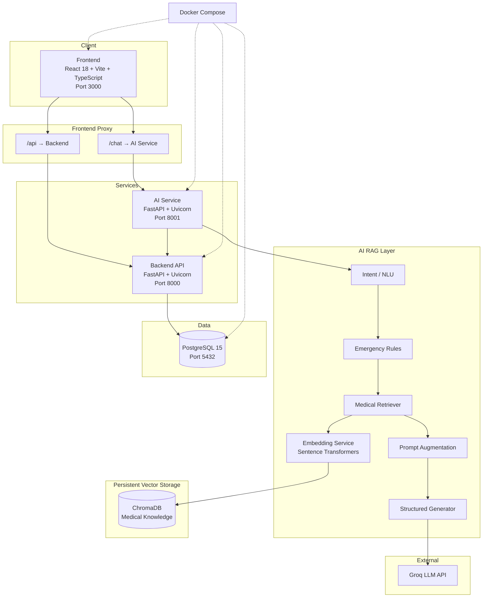
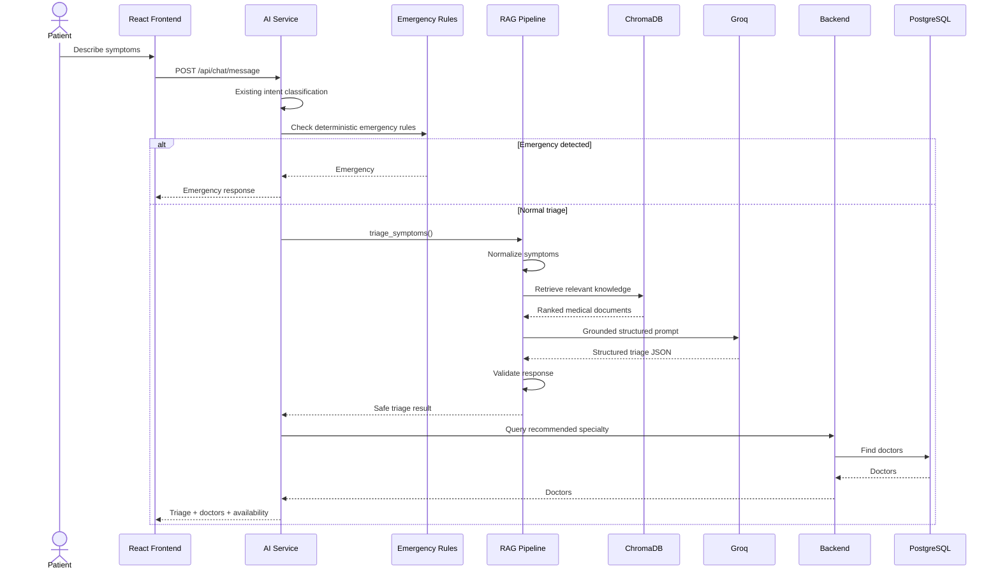

# MediBook AI

**AI-powered virtual receptionist for small and medium-sized clinics in Pakistan — combining conversational AI, safe medical RAG, real-time appointment management, and clinic operations in one platform.**

[](https://react.dev/)
[](https://fastapi.tiangolo.com/)
[](https://www.postgresql.org/)
[](https://docs.docker.com/compose/)
[](https://groq.com/)
[](https://www.trychroma.com/)

---

## Three Implementations

MediBook AI is developed as **three complete, independently runnable implementations**, allowing the evolution from a deterministic baseline to grounded medical RAG and finally to an agentic RAG architecture.

| Version | Branch | Description |
|---|---|---|
| **Agentic RAG** | [`main`](https://github.com/Mzaq1559/MEDIBOOK_AI/tree/main) | The latest implementation. A Groq tool-calling agent reasons over the conversation and uses clinic tools for doctor lookup, availability, appointments, and RAG-grounded medical guidance. All write actions use a backend-enforced propose → confirm → execute flow. |

| **RAG-enabled (this branch) ⭐** | [`rag`](https://github.com/Mzaq1559/MEDIBOOK_AI/tree/rag) | Builds on the baseline with a ChromaDB-backed medical RAG layer for grounded symptom triage while retaining the deterministic conversation state machine. |
| **Baseline / Non-RAG** | [`baseline`](https://github.com/Mzaq1559/MEDIBOOK_AI/tree/baseline) | Original clinic platform with deterministic conversation handling and symptom triage, without retrieval or vector search. |


All three branches are **complete, independently runnable implementations**.

### Development Flow

```text
Baseline / Non-RAG
      │
      │ Bug fixes & improvements
      ▼
RAG-Enabled (this branch)
      │
      │ Agentic architecture
      ▼
Agentic RAG
```

Bug fixes and improvements made to the baseline implementation are regularly merged into `rag`, ensuring that the RAG implementation remains aligned with the latest stable clinic platform.


## Table of Contents

1. [Hackathon Context](#hackathon-context)
2. [Project Status](#project-status)
3. [Problem Statement](#problem-statement)
4. [Solution Overview](#solution-overview)
5. [RAG Architecture](#rag-architecture)
6. [Safety Architecture](#safety-architecture)
7. [Architecture Diagram](#architecture-diagram)
8. [Tech Stack](#tech-stack)
9. [Key Features](#key-features)
10. [What You Can Demo Right Now](#what-you-can-demo-right-now)
11. [Getting Started / Local Setup](#getting-started--local-setup)
12. [RAG Configuration](#rag-configuration)
13. [Knowledge Base](#knowledge-base)
14. [RAG Health & Operations](#rag-health--operations)
15. [API Documentation](#api-documentation)
16. [Database Schema](#database-schema)
17. [AI Chatbot Architecture](#ai-chatbot-architecture)
18. [Project Structure](#project-structure)
19. [Testing](#testing)
20. [Known Limitations / Future Work](#known-limitations--future-work)
21. [Team](#team)
22. [License](#license)

---

## Hackathon Context

**Event:** [Alibaba Cloud AI Hackathon Pakistan 2026](https://github.com/Mzaq1559/MEDIBOOK_AI)

**Theme:** *AI for Pakistan's Future*

**Build window:** August 22 – September 4, 2026 · Taxila, Pakistan

**Team size:** 4 members

| Role         | Contributor                  | GitHub                                                   |
| ------------ | ----------------------------- | --------------------------------------------------------- |
| Project Lead | Muhammad Zulqarnain Abdullah | [@Mzaq1559](https://github.com/Mzaq1559)                 |
| Backend      | Sidra Pervaiz                | [@SidraPervaiz1122](https://github.com/SidraPervaiz1122) |
| Frontend     | Aleeza Imran                 | [@BSCS2455](https://github.com/BSCS2455)                 |
| AI Service   | Ayesha Sajjad                | [@AyeshaSajjad0786](https://github.com/AyeshaSajjad0786) |

---

## Project Status

**MediBook AI's core MVP is operational, with the AI service enhanced by a Retrieval-Augmented Generation (RAG) architecture for grounded symptom triage and medical knowledge retrieval.**

The platform currently includes:

- Patient authentication and dashboard
- AI conversational assistant
- Deterministic emergency detection
- RAG-powered medical knowledge retrieval
- Grounded symptom triage
- Specialty routing
- Real-time doctor lookup
- Doctor availability
- Appointment booking
- Appointment rescheduling
- Appointment cancellation
- Admin dashboard
- Doctor dashboard
- Prescriptions
- Google Calendar integration
- Email reminders
- n8n automation integration
- PostgreSQL persistence
- Docker Compose deployment
- Automated backend and AI-service tests

RAG is implemented as an **additive layer** around the existing AI service. Operational workflows such as booking, rescheduling, cancellation, doctor lookup, and availability remain controlled by the existing deterministic application logic.

---

## Problem Statement

Pakistan's small and medium-sized clinics face recurring operational challenges:

- **Manual appointment management** — bookings handled through phone calls, WhatsApp, or paper.
- **Double bookings and missed appointments** — limited real-time availability management.
- **Receptionist overload** — staff repeatedly answer questions about hours, fees, doctors, and availability.
- **Limited availability visibility** — patients often do not know which doctors or slots are available.
- **No after-hours support** — patients cannot interact with the clinic outside working hours.
- **High no-show rates** — appointments can be missed without automated reminders.
- **Unstructured symptom descriptions** — patients often do not know which medical specialty to approach.

MediBook AI addresses these problems by combining conversational AI with deterministic clinic business logic and a grounded medical knowledge layer.

---

## Solution Overview

MediBook AI is a **24/7 AI virtual receptionist and clinic management platform**.

Patients can communicate naturally with the system instead of navigating complex menus.

For symptom-related requests, MediBook AI can:

1. Detect emergency situations using deterministic safety rules.
2. Identify the user's intent.
3. Normalize the reported symptoms.
4. Retrieve relevant medical knowledge from a curated knowledge base.
5. Ground the LLM response using retrieved context.
6. Recommend an appropriate medical specialty.
7. Provide conservative informational triage guidance.
8. Query real doctor availability through the backend.
9. Continue into the existing appointment booking flow when appropriate.

For operational requests, the existing chatbot flows remain authoritative.

### Core principle

```
Existing MediBook AI
        +
Safe Medical RAG
        =
Grounded MediBook AI
```

RAG provides medical context. It does **not** replace the application's emergency rules, business logic, authorization, doctor availability, or appointment validation.

---

## RAG Architecture

The RAG system is isolated inside the existing AI service:

```
ai-service/app/rag/
```

The architecture contains the following components:

| Component              | Responsibility                                   |
| ----------------------- | -------------------------------------------------- |
| `config.py`            | RAG configuration and environment variables      |
| `models.py`            | Pydantic models and structured response schemas  |
| `vector_db.py`         | ChromaDB initialization and persistence           |
| `embeddings.py`        | Sentence-transformer embedding generation         |
| `retriever.py`         | Medical knowledge retrieval and filtering         |
| `augmentation.py`      | Grounded prompt construction                      |
| `generator.py`         | Structured Groq LLM generation                    |
| `pipeline.py`          | Complete RAG triage orchestration                 |
| `safety.py`            | RAG-specific safety checks                        |
| `cache.py`             | Safe medical knowledge retrieval caching          |
| `knowledge_loader.py`  | Knowledge-base validation and indexing            |

### RAG request flow

```
Patient message
      │
      ▼
Existing Chatbot
      │
      ▼
Intent Classification
      │
      ├──────── booking ────────► Existing booking flow
      │
      ├──────── reschedule ─────► Existing reschedule flow
      │
      ├──────── cancellation ───► Existing cancellation flow
      │
      ├──────── lookup ─────────► Existing doctor lookup
      │
      └──────── triage ─────────► RAG Pipeline
                                      │
                                      ▼
                              Emergency Detection
                                      │
                              ┌───────┴───────┐
                              │               │
                           Emergency        Normal
                              │               │
                              ▼               ▼
                       Emergency       Symptom Normalization
                        Response              │
                                              ▼
                                      Query Embedding
                                              │
                                              ▼
                                         ChromaDB
                                              │
                                              ▼
                                    Relevance Filtering
                                              │
                                              ▼
                                      Prompt Augmentation
                                              │
                                              ▼
                                          Groq LLM
                                              │
                                              ▼
                                     Pydantic Validation
                                              │
                                              ▼
                                     Safe Triage Response
```

---

## Safety Architecture

Medical safety takes priority over generated responses.

The system follows this hierarchy:

```
1. Deterministic emergency rules
2. Existing business logic
3. RAG medical grounding
4. LLM generation
```

### Emergency rules always execute first

For example:

```
User:
"I have severe chest pain and I cannot breathe properly."
```

The existing emergency detector must identify this as a high-priority emergency before normal RAG generation.

The resulting response should direct the patient toward immediate emergency medical attention rather than recommending a routine clinic appointment.

### RAG cannot downgrade an emergency

The LLM does not control emergency status.

A retrieved document or generated response cannot override a deterministic emergency rule.

### The AI does not diagnose

MediBook AI provides:

- informational triage guidance
- symptom summaries
- specialty routing
- urgency guidance
- general medical knowledge

It does **not** provide definitive medical diagnoses.

---

## Architecture Diagram

### System Architecture



The Vite development server proxies backend and AI-service requests so the frontend can operate through a single local development interface.

---

## Patient Symptom Triage Flow



---

## Tech Stack

| Layer               | Technologies                                                    |
| -------------------- | ----------------------------------------------------------------- |
| **Frontend**        | React 18, TypeScript, Vite, Tailwind CSS, React Router, Axios   |
| **Backend**         | FastAPI, Uvicorn, SQLAlchemy, Alembic, Pydantic v2, JWT          |
| **AI Service**      | FastAPI, Groq SDK, httpx, deterministic triage, RAG              |
| **LLM**             | Groq API                                                         |
| **Embeddings**      | Sentence Transformers                                            |
| **Vector Database** | ChromaDB                                                          |
| **Database**        | PostgreSQL 15                                                    |
| **Caching**         | Lightweight in-process RAG retrieval cache                       |
| **Deployment**      | Docker + Docker Compose                                          |
| **Automation**      | n8n                                                               |
| **Calendar**        | Google Calendar integration                                      |
| **Notifications**   | SMTP email reminders                                              |

---

## Key Features

### AI & Medical RAG

- ✅ Conversational AI assistant
- ✅ Groq-powered intent classification
- ✅ Deterministic emergency detection
- ✅ RAG-powered symptom triage
- ✅ ChromaDB persistent vector storage
- ✅ Sentence-transformer embeddings
- ✅ Curated version-controlled medical knowledge base
- ✅ Metadata-aware retrieval
- ✅ Minimum relevance threshold
- ✅ Structured Pydantic-validated LLM responses
- ✅ Safe RAG fallback
- ✅ RAG feature flag
- ✅ Lightweight circuit breaker
- ✅ Retrieval caching
- ✅ RAG health endpoint
- ✅ Retrieval and generation observability
- ✅ Grounded medical source references

### Clinic Operations

- ✅ Patient authentication
- ✅ Patient dashboard
- ✅ Doctor dashboard
- ✅ Admin dashboard
- ✅ Doctor lookup
- ✅ Doctor availability
- ✅ Appointment booking
- ✅ Appointment rescheduling
- ✅ Appointment cancellation
- ✅ Appointment conflict validation
- ✅ Prescriptions
- ✅ Google Calendar synchronization
- ✅ Email reminders
- ✅ n8n integration

### Security & Safety

- ✅ JWT authentication
- ✅ Role-based access control
- ✅ Deterministic emergency handling
- ✅ Backend-authoritative appointment creation
- ✅ Backend-authoritative doctor availability
- ✅ Clinic-aware RAG metadata
- ✅ No cross-clinic knowledge retrieval
- ✅ LLM output validation
- ✅ No direct appointment creation by the LLM
- ✅ PHI-conscious logging

---

## What You Can Demo Right Now

### 1. AI Health Chat + RAG Triage

Log in as a patient and open:

```
/chat
```

Example:

```
I've had a sore throat and cough for two days.
```

The system can:

```
User message
    ↓
Intent classification
    ↓
Emergency check
    ↓
RAG retrieval
    ↓
Grounded medical response
    ↓
Specialty recommendation
    ↓
Doctor lookup
    ↓
Live availability
```

The response is informational and does not constitute a diagnosis.

---

### 2. Emergency Detection

Example:

```
I have severe chest pain and I cannot breathe properly.
```

Expected behavior:

```
Existing emergency detector
        ↓
Emergency response
        ↓
No normal appointment recommendation
        ↓
RAG cannot downgrade the emergency
```

---

### 3. Booking

```
I want to book an appointment.
```

Expected:

```
Existing booking state machine
        ↓
Doctor selection
        ↓
Availability
        ↓
Confirmation
        ↓
Backend appointment creation
```

RAG does not interfere with the booking flow.

---

### 4. Rescheduling

Existing rescheduling flow remains active.

---

### 5. Cancellation

Existing cancellation flow remains active.

---

### 6. Admin Dashboard

The admin dashboard provides:

- Clinic metrics
- Doctor rosters
- Appointment statistics
- Clinic management functionality

---

### 7. Doctor Dashboard

Doctors can:

- Authenticate
- View appointments
- Update appointment status
- Access their role-specific dashboard

---

## Getting Started / Local Setup

### Prerequisites

- Docker
- Docker Compose v2+
- Git
- Groq API key

### 1. Clone

```bash
git clone https://github.com/Mzaq1559/MEDIBOOK_AI.git
cd MEDIBOOK_AI
```

### 2. Configure Environment

```bash
cp .env.example .env
```

At minimum:

```env
GROQ_API_KEY=your-groq-api-key
GROQ_MODEL=openai/gpt-oss-120b
```

### 3. Build and Start

```bash
docker compose build
docker compose up -d
```

Services:

| Service    | Port |
| ---------- | ---- |
| Frontend   | 3000 |
| Backend    | 8000 |
| AI Service | 8001 |
| PostgreSQL | 5432 |
| n8n        | 5678 |

### 4. Verify Services

```bash
curl http://localhost:8000/health
curl http://localhost:8001/health
curl http://localhost:8001/api/rag/health
```

---

## RAG Configuration

RAG is controlled through environment variables.

```env
RAG_ENABLED=true
RAG_VECTOR_DB_PATH=/app/data/chroma
RAG_COLLECTION_NAME=medical_knowledge
RAG_EMBEDDING_MODEL=sentence-transformers/all-MiniLM-L6-v2
RAG_TOP_K=5
RAG_MIN_RELEVANCE_SCORE=0.35
RAG_CACHE_ENABLED=true
```

### Configuration Reference

| Variable                  | Purpose                       | Example                                  |
| -------------------------- | ------------------------------ | ------------------------------------------ |
| `RAG_ENABLED`             | Enables/disables RAG          | `true`                                    |
| `RAG_VECTOR_DB_PATH`      | Persistent ChromaDB location  | `/app/data/chroma`                        |
| `RAG_COLLECTION_NAME`     | Chroma collection             | `medical_knowledge`                       |
| `RAG_EMBEDDING_MODEL`     | Embedding model               | `sentence-transformers/all-MiniLM-L6-v2`  |
| `RAG_TOP_K`               | Maximum retrieved documents   | `5`                                        |
| `RAG_MIN_RELEVANCE_SCORE` | Minimum retrieval relevance   | `0.35`                                     |
| `RAG_CACHE_ENABLED`       | Enables retrieval caching     | `true`                                     |

If:

```env
RAG_ENABLED=false
```

the AI service falls back toward the existing non-RAG triage behavior.

This provides a rollback mechanism without disabling the rest of the MediBook platform.

---

## Knowledge Base

The initial medical knowledge base is version-controlled under:

```
ai-service/app/knowledge_base/
```

The knowledge base contains structured information for:

```
symptoms
conditions
specialties
emergency protocols
clinic procedures
```

Example document:

```json
{
  "id": "chest_pain_001",
  "type": "symptom",
  "name": "Chest pain",
  "description": "A symptom involving discomfort, pressure, tightness, or pain in the chest.",
  "associated_conditions": [],
  "red_flags": [],
  "recommended_specialties": [],
  "triage_level": "high",
  "source": "internal_knowledge_base",
  "version": "1.0"
}
```

Knowledge records preserve metadata such as:

```
id
type
name
specialty
urgency
clinic_id
source
version
last_updated
```

### Important

The knowledge base is intended for **grounded informational triage and routing**.

It should not be interpreted as a replacement for professional medical guidelines, clinical judgment, or emergency services.

Sources displayed to users correspond to actual documents stored in the MediBook knowledge base.

---

## Clinic-Specific Knowledge

The RAG architecture supports clinic-specific knowledge.

Global documents use:

```
clinic_id = null
```

Clinic-specific documents use:

```
clinic_id = <clinic identifier>
```

Retrieval can combine:

```
Global medical knowledge
        +
Current clinic knowledge
```

while preventing retrieval of documents belonging to another clinic.

This allows future expansion toward:

```
Clinic A
    ├── Global medical knowledge
    └── Clinic A procedures

Clinic B
    ├── Global medical knowledge
    └── Clinic B procedures
```

---

## Knowledge Base Management

The knowledge index can be rebuilt using:

```bash
docker compose exec ai-service python -m app.rag.knowledge_loader --rebuild
```

The loader:

1. Reads knowledge-base JSON files.
2. Validates records.
3. Converts records into searchable documents.
4. Generates embeddings.
5. Stores documents and metadata in ChromaDB.
6. Avoids unnecessary duplicate processing.
7. Reports loading statistics.

ChromaDB data is persisted so that container restarts do not require rebuilding the entire index.

---

## RAG Health & Operations

Health endpoint:

```
GET /api/rag/health
```

Example:

```json
{
  "enabled": true,
  "vector_db": "healthy",
  "embedding_model": "loaded",
  "collection": "medical_knowledge",
  "document_count": 52
}
```

The health endpoint intentionally does not expose sensitive configuration.

### Operational checks

```bash
curl -s http://localhost:8001/api/rag/health | python3 -m json.tool
```

Useful Docker commands:

```bash
docker compose logs -f ai-service
```

```bash
docker compose exec ai-service pytest -v
```

```bash
docker compose restart ai-service
```

---

## RAG Failure & Fallback

RAG is intentionally designed as an additive layer.

Failures in:

- ChromaDB
- embedding generation
- retrieval
- Groq
- JSON validation
- prompt construction
- timeouts
- unexpected RAG exceptions

must not make the overall chatbot unavailable.

The fallback hierarchy is:

```
RAG failure
    ↓
Existing deterministic triage/business logic
    ↓
Safe response
```

Internal logs identify failures such as:

```
RAG retrieval failed
RAG generation failed
RAG validation failed
RAG fallback activated
```

Internal exceptions are never returned directly to patients.

---

## Circuit Breaker

The RAG subsystem contains a lightweight circuit breaker:

```
CLOSED
   │
   │ repeated failures
   ▼
OPEN
   │
   │ cooldown
   ▼
HALF_OPEN
   │
   ├── success ──► CLOSED
   │
   └── failure ──► OPEN
```

When RAG repeatedly fails, new RAG requests temporarily use the fallback path.

The circuit breaker does not affect:

- booking
- rescheduling
- cancellation
- doctor lookup
- availability
- authentication
- backend operations

---

## API Documentation

Interactive API documentation is available when the services are running.

| Service            | Documentation                          |
| ------------------- | ---------------------------------------- |
| Backend Swagger    | `http://localhost:8000/docs`           |
| Backend ReDoc      | `http://localhost:8000/redoc`          |
| AI Service Swagger | `http://localhost:8001/docs`           |
| RAG Health         | `http://localhost:8001/api/rag/health` |

### Primary Endpoint Groups

| Group         | Purpose                                              |
| -------------- | ------------------------------------------------------ |
| Auth          | Registration, login, refresh, logout, current user   |
| Appointments  | Booking, rescheduling, cancellation, completion      |
| Prescriptions | Prescription CRUD                                     |
| Doctors       | Lookup, details, availability, schedules              |
| Clinics       | Clinic management                                     |
| Patients      | Patient profile and appointment history                |
| Analytics     | Dashboard metrics                                      |
| Chat          | Conversational AI                                      |
| RAG Health    | RAG subsystem health                                    |

---

## Database Schema

The main application database uses PostgreSQL.

Core entities include:

```
users
clinics
doctors
patients
appointments
prescriptions
doctor_schedules
clinic_holidays
audit_logs
```

The relational database remains the source of truth for:

- Users
- Authentication
- Doctors
- Patients
- Clinics
- Appointments
- Availability
- Prescriptions
- Authorization

ChromaDB is used only for medical knowledge retrieval.

It does **not** replace PostgreSQL.

---

## AI Chatbot Architecture

The AI service combines:

```
Existing Conversation State Machine
+
Groq NLU
+
Deterministic Safety Rules
+
RAG Medical Knowledge
+
Backend Business Logic
```

### Intent Routing

| Intent               | Handler                        |
| ---------------------- | --------------------------------- |
| `appointment`        | Existing booking flow           |
| `symptom` / `triage` | RAG triage pipeline              |
| `faq`                 | Existing conversational logic    |
| `reschedule`          | Existing rescheduling flow       |
| `cancel`              | Existing cancellation flow       |
| `lookup`              | Existing doctor lookup           |

### Critical design rule

**Not every chatbot message goes through RAG.**

Only medical/symptom-oriented requests and appropriate medical knowledge questions use the RAG layer.

Operational requests continue using their existing deterministic flows.

---

## Structured RAG Response

RAG generation uses structured output rather than free-form parsing.

Conceptually:

```json
{
  "urgency": "routine",
  "specialty": "General Physician",
  "recommendation": "A general physician can evaluate these symptoms.",
  "reasoning_summary": "The reported symptoms are appropriate for an initial general medical evaluation.",
  "red_flags": [],
  "confidence": "medium",
  "needs_emergency_care": false,
  "sources": [
    {
      "id": "symptom_001",
      "title": "Symptom Guidance",
      "type": "symptom"
    }
  ]
}
```

The response is validated with Pydantic before being returned to the frontend.

The system does not expose internal retrieval scores or embeddings to patients.

---

## Confidence

Confidence is treated as **routing confidence**, not medical diagnostic confidence.

The system can consider measurable signals such as:

```
retrieval relevance
+
intent classification confidence
+
deterministic rule agreement
+
structured response validation
```

The patient should never see claims such as:

```
95% diagnosis confidence
```

because MediBook AI is not a diagnostic system.

---

## Frontend RAG Presentation

The existing chat interface remains intact.

RAG adds optional information such as:

```
Medical knowledge used

• Chest pain symptom guidance
• Shortness of breath guidance

This information is for general guidance and does not replace
professional medical evaluation.
```

The frontend does not expose:

- embeddings
- vector IDs
- raw Chroma metadata
- internal retrieval scores
- internal model diagnostics

---

## Project Structure

```
MEDIBOOK_AI/
│
├── backend/
│   ├── app/
│   │   ├── routes/
│   │   ├── models/
│   │   ├── services/
│   │   ├── schemas/
│   │   └── core/
│   ├── alembic/
│   └── tests/
│
├── frontend/
│   └── src/
│       ├── pages/
│       ├── services/
│       └── components/
│
├── ai-service/
│   ├── app/
│   │   ├── chatbot.py
│   │   ├── groq_client.py
│   │   ├── symptom_triage.py
│   │   ├── backend_client.py
│   │   │
│   │   ├── rag/
│   │   │   ├── __init__.py
│   │   │   ├── config.py
│   │   │   ├── models.py
│   │   │   ├── vector_db.py
│   │   │   ├── embeddings.py
│   │   │   ├── retriever.py
│   │   │   ├── augmentation.py
│   │   │   ├── generator.py
│   │   │   ├── pipeline.py
│   │   │   ├── safety.py
│   │   │   ├── cache.py
│   │   │   └── knowledge_loader.py
│   │   │
│   │   └── knowledge_base/
│   │       ├── symptoms.json
│   │       ├── conditions.json
│   │       ├── specialties.json
│   │       ├── emergency_protocols.json
│   │       └── clinic_procedures.json
│   │
│   ├── data/
│   │   └── chroma/
│   │
│   └── tests/
│       ├── test_rag_retriever.py
│       ├── test_rag_pipeline.py
│       ├── test_rag_safety.py
│       └── test_rag_integration.py
│
├── docs/
│   ├── RAG_ARCHITECTURE.md
│   ├── RAG_SETUP.md
│   └── MEDIBOOK_AI_COMPLETE_SPECIFICATIONS.txt
│
├── docker-compose.yml
├── .env.example
└── README.md
```

---

## Testing

### Backend

```bash
docker compose exec backend pytest -v
```

Coverage:

```bash
docker compose exec backend pytest --cov=app --cov-report=term-missing
```

Backend tests cover areas including:

- Authentication
- Appointments
- Double-booking prevention
- Doctor availability
- Clinics
- Patients
- Analytics
- Prescriptions
- Seeding
- Error handling

---

### AI Service

```bash
docker compose exec ai-service pytest -v
```

The AI test suite covers:

- Existing symptom triage rules
- Emergency detection
- Intent classification
- RAG retrieval
- Metadata filtering
- RAG pipeline
- Structured response validation
- RAG fallback
- ChromaDB failures
- Groq failures
- Chat API integration

---

## RAG Tests

RAG tests verify:

### Vector database

- Initialization
- Persistence
- Document insertion
- Retrieval
- Metadata filtering
- Empty results

### Retriever

- Relevant queries
- Irrelevant queries
- Relevance threshold
- Duplicate removal
- Clinic filtering

### Pipeline

- Successful retrieval
- Successful generation
- Malformed LLM JSON
- Groq failure
- ChromaDB failure
- Fallback behavior

### Safety

Emergency scenarios such as:

```
severe chest pain + difficulty breathing
```

must always trigger the deterministic emergency path.

RAG must never downgrade the emergency.

---

## End-to-End Verification

The following workflows should remain operational:

| Scenario             | Expected Behavior                 |
| ---------------------- | ------------------------------------ |
| Normal symptom       | RAG retrieval → grounded triage    |
| Emergency symptom    | Deterministic emergency response   |
| Booking              | Existing booking flow              |
| Rescheduling         | Existing rescheduling flow         |
| Cancellation         | Existing cancellation flow         |
| Doctor lookup        | Existing backend lookup            |
| Availability         | Existing availability engine       |
| RAG unavailable      | Safe fallback                       |
| Groq unavailable     | Safe fallback                       |
| ChromaDB unavailable | Safe fallback                       |
| Container restart    | ChromaDB data persists              |

---

## Observability

RAG operations expose metrics such as:

```
rag_requests_total
rag_success_total
rag_fallback_total
rag_errors_total
rag_retrieval_latency
rag_generation_latency
rag_total_latency
rag_cache_hits
rag_cache_misses
rag_documents_count
```

Where monitoring infrastructure already exists, RAG metrics can be integrated into the existing monitoring stack rather than introducing a separate monitoring system.

Logging should avoid unnecessary patient health information or complete conversation transcripts.

---

## Security

Medical information is handled carefully throughout the architecture.

Key principles:

- Do not log unnecessary PHI.
- Do not place patient conversations into the medical knowledge cache.
- Do not use sensitive conversation content as a cache key.
- Prevent cross-clinic knowledge retrieval.
- Validate user input.
- Validate all LLM output.
- Never trust LLM-generated doctor or specialty identifiers.
- Verify specialties and doctors against backend data.
- Never allow LLM output to directly create an appointment.
- PostgreSQL remains the source of truth for appointments and availability.
- Existing authorization rules remain authoritative.

The LLM recommends.

The backend decides what is actually possible.

---

## Known Limitations / Future Work

### Current Scope

- **Web-first** — responsive web application; native mobile applications are outside current scope.
- **English-primary** — Urdu/English bilingual support is planned.
- **In-memory conversational sessions** — chat sessions currently reset when the AI service restarts.
- **Medical knowledge scope** — the initial RAG knowledge base focuses on common symptoms, conditions, specialties, emergency indicators, and clinic procedures.
- **RAG is informational** — it is not intended to provide medical diagnoses.

### Future Improvements

1. Expand and clinically review the medical knowledge base.
2. Add Urdu/English bilingual medical retrieval.
3. Persist conversation state using PostgreSQL or Redis.
4. Add richer clinic-specific knowledge management.
5. Introduce formal knowledge-base versioning and review workflows.
6. Improve retrieval evaluation and relevance benchmarking.
7. Add hybrid lexical + vector retrieval where beneficial.
8. Obtain WhatsApp Business API approval and implement WhatsApp reminders.
9. Build advanced n8n workflows.
10. Develop native mobile applications.

---

## Integrations

| Feature            | Status             | Notes                                          |
| -------------------- | -------------------- | ------------------------------------------------- |
| Doctor Dashboard   | ✅ Implemented      | Authentication, appointments, status updates    |
| Prescriptions      | ✅ Implemented      | CRUD with authorization and soft deletes        |
| Google Calendar    | ✅ Implemented      | Appointment synchronization                     |
| Email Reminders    | ✅ Implemented      | 24h/1h reminder scheduler                        |
| n8n                | ✅ Integrated       | Containerized automation service                |
| WhatsApp Reminders | ❌ Not Implemented  | Requires WhatsApp Business API                  |
| Payment Gateway    | ❌ Not in Scope     | Future feature                                   |
| Mobile App         | ❌ Not in Scope     | Future feature                                   |
| Multi-language UI  | ❌ Not in Scope     | Planned                                           |

---

## Team

Built by a 4-person team for the **Alibaba Cloud AI Hackathon Pakistan 2026**.

| Name                         | Role               | GitHub                                                   | Contributions                                                                                |
| ----------------------------- | -------------------- | ----------------------------------------------------------- | ------------------------------------------------------------------------------------------------ |
| Muhammad Zulqarnain Abdullah | Project Lead       | [@Mzaq1559](https://github.com/Mzaq1559)                 | Architecture, Docker, seeding, chat integration, RAG integration, repository coordination     |
| Sidra Pervaiz                | Backend Developer  | [@SidraPervaiz1122](https://github.com/SidraPervaiz1122) | FastAPI backend, database models, appointment engine, authorization, tests                    |
| Aleeza Imran                 | Frontend Developer | [@BSCS2455](https://github.com/BSCS2455)                 | React UI, design system, page layouts, chat interface                                          |
| Ayesha Sajjad                | AI & Integrations  | [@AyeshaSajjad0786](https://github.com/AyeshaSajjad0786) | AI microservice, Groq integration, NLU, symptom triage, conversational flows, integrations    |

---

## License

No open-source license file is currently included in this repository.

This project is submitted for **Alibaba Cloud AI Hackathon Pakistan 2026** evaluation purposes.
