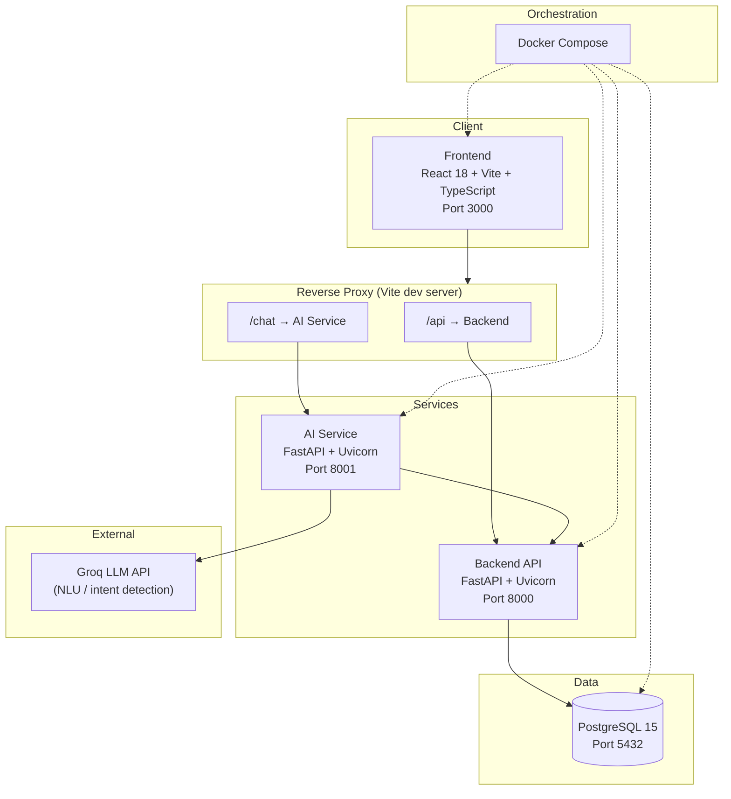
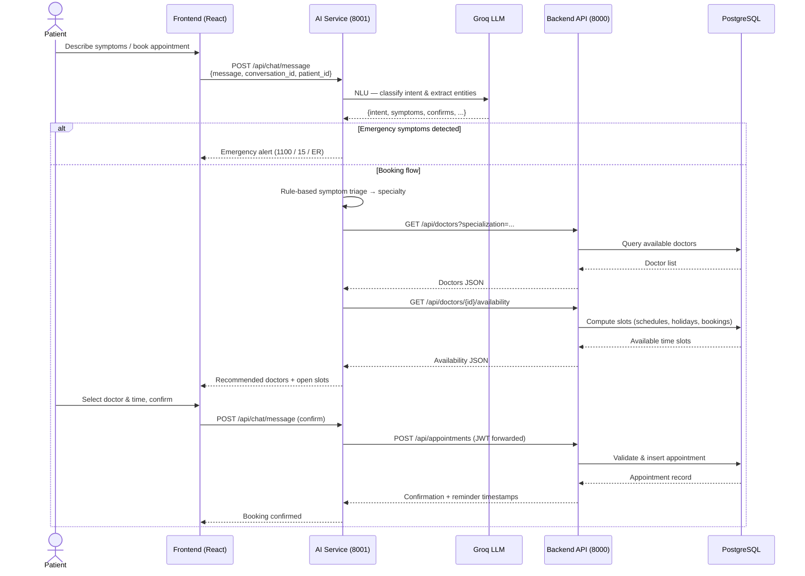
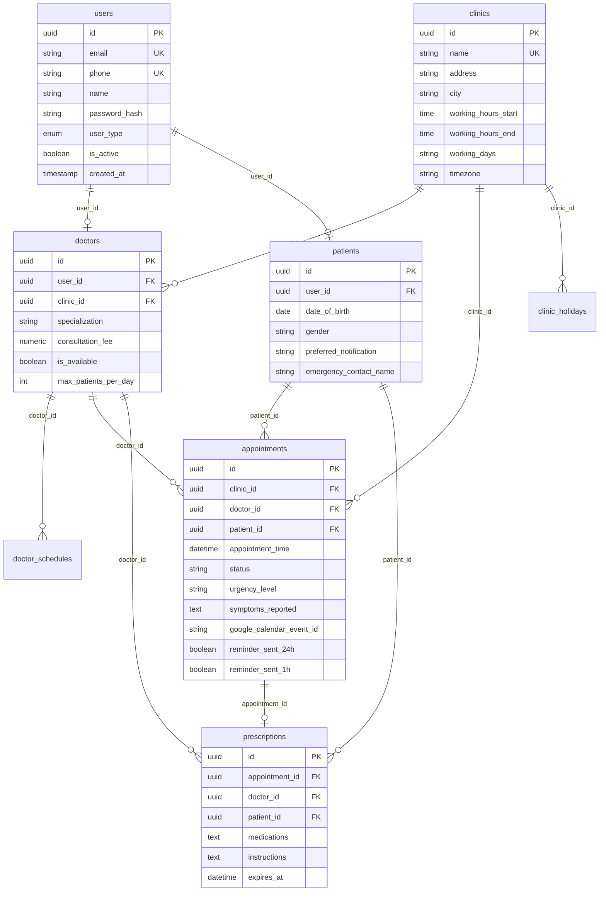

# MediBook AI

**AI-powered virtual receptionist for small and medium clinics in Pakistan — book appointments, triage symptoms, and manage clinic operations through natural conversation.**

[](https://react.dev/)
[](https://fastapi.tiangolo.com/)
[](https://www.postgresql.org/)
[](https://docs.docker.com/compose/)
[](https://groq.com/)

---

## Table of Contents

1. [Hackathon Context](#hackathon-context)
2. [Problem Statement](#problem-statement)
3. [Solution Overview](#solution-overview)
4. [Architecture Diagram](#architecture-diagram)
5. [Tech Stack](#tech-stack)
6. [Key Features](#key-features)
7. [What You Can Demo Right Now](#what-you-can-demo-right-now)
8. [Getting Started / Local Setup](#getting-started--local-setup)
9. [API Documentation](#api-documentation)
10. [Database Schema](#database-schema)
11. [AI Chatbot Capabilities](#ai-chatbot-capabilities)
12. [Project Structure](#project-structure)
13. [Testing](#testing)
14. [Known Limitations / Future Work](#known-limitations--future-work)
15. [Team](#team)
16. [License](#license)

---

## Hackathon Context

**Event:** [Alibaba Cloud AI Hackathon Pakistan 2026](https://github.com/Mzaq1559/MEDIBOOK_AI)  
**Theme:** *AI for Pakistan's Future*  
**Build window:** August 22 – September 4, 2026 (extended build phase) · Taxila, Pakistan  
**Team size:** 4 members

| Role | Contributor | GitHub |
|------|-------------|--------|
| Project Lead | Muhammad Zulqarnain Abdullah | [@Mzaq1559](https://github.com/Mzaq1559) |
| Backend | Sidra Pervaiz | [@SidraPervaiz1122](https://github.com/SidraPervaiz1122) |
| Frontend | Aleeza Imran | [@BSCS2455](https://github.com/BSCS2455) |
| AI Service | Ayesha Sajjad | [@AyeshaSajjad0786](https://github.com/AyeshaSajjad0786) |

---

## Project Status

All core MVP features complete. Prescriptions, n8n, and Google Calendar/Email integrations added post-MVP. Ready for regional technical evaluation (submission deadline: 4 September 2026).

---

## Problem Statement

Pakistan's small and medium-sized clinics face recurring operational pain points (from our project specification in `docs/MEDIBOOK_AI_COMPLETE_SPECIFICATIONS.txt`):

- **Manual appointment management** — bookings handled over phone, WhatsApp, or paper with no central system
- **Double bookings and missed appointments** — no real-time availability checks across doctors and time slots
- **Receptionist overload** — staff answer the same questions about hours, fees, and availability repeatedly
- **No availability tracking** — patients arrive without knowing wait times or open slots
- **No after-hours support** — patients cannot get help when the clinic is closed
- **High no-show rates** — without automated reminders, scheduled slots go unused

These constraints hit clinics hardest where a single receptionist juggles walk-ins, phone calls, and record-keeping simultaneously.

---

## Solution Overview

MediBook AI is a **24/7 AI virtual receptionist** backed by a full clinic management API. Patients describe symptoms in plain language; the system triages urgency, recommends a specialist, checks live doctor availability, and books appointments with conflict validation.

### Feature Implementation Summary

| Area | Status | Description |
|------|--------|-------------|
| **Patient Login & Dashboard** | ✅ Fully Working | Shows real appointment history |
| **AI Health Chat (Groq LLM)** | ✅ Fully Working | Symptom triage and natural language interaction working |
| **Full Patient Booking Flow** | ✅ Fully Working | Symptom → AI recommendation → doctor selection → appointment confirmation → saved to DB |
| **Admin Login & Dashboard** | ✅ Fully Working | Displays real clinic metrics, doctor rosters, and clinic management |
| **Doctor Dashboard** | ✅ Fully Implemented | Login/redirect/appointment viewing/status updates all working |
| **Role-Based Route Guards** | ✅ Fully Working | Patient/Doctor/Admin isolation and redirection active |
| **Authentication System** | ✅ Fully Working | Secure JWT authentication with refresh token flow |
| **Docker Compose Deployment** | ✅ Fully Working | All 5 services running (`frontend`, `backend`, `ai-service`, `db`, `n8n`) |
| **Test Data Seeding** | ✅ Fully Working | 3 clinics, 3 doctors, 3 patients, 300+ appointments seeded |
| **Prescriptions** | ✅ Fully Implemented | All 5 CRUD REST API endpoints (GET, POST, PUT, DELETE, LIST) implemented with soft deletes and authorization |
| **Google Calendar & Email** | ✅ Fully Implemented | calendar_service.py, email_service.py, scheduler.py active. Syncs appointments to Google Calendar + sends 24h/1h SMTP reminders (best-effort) |
| **n8n Automation** | ✅ Service Running | n8n containerized in docker-compose on port 5678. Webhook code in ai-service/integrations/n8n_webhook.py ready for workflow triggering |
| **WhatsApp Reminders** | ❌ Not Implemented | Requires WhatsApp Business API approval and setup |
| **Payment Gateway** | ❌ Not in Scope | Planned for future release |
| **Multi-Language UI** | ❌ Not in Scope | Planned for future release |
| **Mobile App** | ❌ Not in Scope | Planned for future release |

---

## Architecture Diagram

### System architecture



The Vite dev server proxies `/api` to the backend and rewrites `/chat` → `/api/chat` on the AI service, so a single frontend port works locally and through dev tunnels.

### Patient books appointment via AI chat



---

## Tech Stack

| Layer | Technologies | Version (where pinned) |
|-------|-------------|------------------------|
| **Frontend** | React, TypeScript, Vite, Tailwind CSS, React Router, Axios, date-fns, react-icons | React ^18.2, Vite ^5.0, Node 18 (Docker) |
| **Backend** | FastAPI, Uvicorn, SQLAlchemy, Alembic, Pydantic v2, PyJWT, passlib/bcrypt, SlowAPI | Python 3.12 (Docker), FastAPI ≥0.110 |
| **AI Service** | FastAPI, Groq SDK, httpx, rule-based triage | Python 3.10 (Docker), Groq SDK ≥0.13 |
| **Database** | PostgreSQL | 15-alpine |
| **DevOps** | Docker, Docker Compose | Compose v2+ |
| **External AI** | Groq API (`GROQ_MODEL`, default `openai/gpt-oss-120b`) | Requires `GROQ_API_KEY` |

---

## Key Features

### ✅ FULLY WORKING
- **Patient Login & Dashboard:** Complete authentication flow, displaying real patient appointment history fetched directly from backend APIs.
- **AI Health Chat with Real Groq LLM:** Interactive assistant leveraging Groq LLM for natural language processing and intelligent symptom triage.
- **Full Patient Booking Flow:** Complete flow: symptom input → AI recommendation → doctor selection → slot confirmation → appointment saved directly to PostgreSQL database.
- **Admin Login & Dashboard:** Comprehensive dashboard rendering live metrics, doctor schedules, and clinic management controls.
- **Doctor Dashboard:** ✅ Fully Implemented (login, redirect, appointment viewing, status updates all working).
- **Role-Based Route Guards:** Robust frontend routing ensuring strict isolation between patient (`/dashboard`), admin (`/admin`), and doctor dashboards.
- **Authentication System:** Secure JWT authentication with refresh token lifecycle handling.
- **Docker Compose Deployment:** Production-grade containerization with all 5 services (`frontend`, `backend`, `ai-service`, `db`, `n8n`) running seamlessly.
- **Test Data Seeding:** Database population scripts seeding 3 clinics, 3 doctors, 3 patients, and 300+ sample appointments for immediate testing.
- **Prescriptions:** ✅ Full CRUD REST API implemented and tested (GET, POST, PUT, DELETE, LIST with soft deletes & role-based authorization).
- **n8n Automation:** ✅ Service containerized and running (webhook dispatcher for appointments on port 5678).
- **Google Calendar & Email Reminders:** ✅ Async background scheduler active (syncing appointments to Google Calendar + 24h/1h SMTP email reminders).

### ❌ NOT IMPLEMENTED / NOT IN SCOPE
- **WhatsApp Reminders:** ❌ Not Implemented. Requires WhatsApp Business API approval and setup.
- **Payment Gateway:** Third-party payment gateway integration.
- **Multi-Language UI:** Localization and multilingual interface options.
- **Mobile App:** Native mobile applications for iOS and Android.

---

## What You Can Demo Right Now

You can demonstrate the fully functional MediBook AI platform using the following verified workflows:

### 1. Full Patient Booking Flow & AI Chat
1. Navigate to `http://localhost:3000/login` and log in as a patient:
   - **Email:** `ali.khan@example.com`
   - **Password:** `BulkSeed123!`
2. Open the **AI Health Chat** (`/chat`).
3. Enter your symptoms (e.g. *"I have had a severe sore throat and fever for two days"* or *"I am experiencing chest tightness"*).
4. The AI assistant powered by **Groq LLM** will:
   - Detect emergency symptoms (if applicable) and direct you to emergency services.
   - Triage your symptoms to the appropriate medical specialty (e.g., ENT Specialist).
   - Query live availability and list matching doctors with available time slots.
5. Select a doctor and time slot, then type `yes` to confirm the booking.
6. The AI microservice communicates with the backend API to create and validate the appointment in PostgreSQL.
7. Return to the **Patient Dashboard** (`/dashboard`) to view your newly booked appointment under real appointment history.

### 2. Admin Dashboard & Operations
1. Log in as an administrator at `http://localhost:3000/login`:
   - **Email:** `admin@medibook.com`
   - **Password:** `Admin@123`
2. You will be automatically directed to the **Admin Dashboard** (`/admin`).
3. View real-time clinic analytics, doctor rosters, clinic records, and overall appointment statistics powered by backend REST endpoints.

### 3. Doctor Login & Role Isolation
1. Log in as a doctor:
   - **Email:** `ahmed.khan@primecare.pk`
   - **Password:** `BulkSeed123!`
2. Verify role-based routing as you are redirected to `/doctor/dashboard`.
3. Test security guards: attempts by non-admin users to access `/admin` or unauthorized routes are automatically blocked and redirected.

---

## Getting Started / Local Setup

### Prerequisites

- [Docker](https://docs.docker.com/get-docker/) and [Docker Compose](https://docs.docker.com/compose/) v2+
- A [Groq API key](https://console.groq.com/) (free tier works for demos)
- Git

### 1. Clone the repository

```bash
git clone https://github.com/Mzaq1559/MEDIBOOK_AI.git
cd MEDIBOOK_AI
```

### 2. Configure environment variables

Copy the root example file and set your Groq key:

```bash
cp .env.example .env
```

Edit `.env` and set at minimum:

```env
GROQ_API_KEY=your-groq-api-key-here
GROQ_MODEL=openai/gpt-oss-120b
```

<details>
<summary>Full environment variable reference</summary>

**Root / Docker Compose** (`.env` — consumed by `ai-service`):

| Variable | Purpose | Default |
|----------|---------|---------|
| `GROQ_API_KEY` | Groq LLM API key | *(required)* |
| `GROQ_MODEL` | Model ID for NLU | `openai/gpt-oss-120b` |

**Backend** (set in `docker-compose.yml` or `backend/.env`):

| Variable | Purpose |
|----------|---------|
| `DATABASE_URL` | PostgreSQL connection string |
| `SECRET_KEY` | JWT signing key (≥32 chars) |
| `ACCESS_TOKEN_EXPIRE_MINUTES` | Access token TTL |
| `REFRESH_TOKEN_EXPIRE_DAYS` | Refresh token TTL |
| `ALLOWED_ORIGINS` | CORS allowed origins |

**AI Service** (set in `docker-compose.yml` or `ai-service/.env`):

| Variable | Purpose |
|----------|---------|
| `BACKEND_API_URL` | Internal backend base URL (`http://backend:8000/api`) |
| `AI_SERVICE_PORT` | Service port (8001) |
| `CONVERSATION_MAX_HISTORY` | Max messages kept in session |

**Frontend** (set in `docker-compose.yml`):

| Variable | Purpose |
|----------|---------|
| `VITE_API_URL` | Backend proxy path (`/api`) |
| `VITE_CHAT_API_URL` | AI service proxy path (`/chat`) |
| `VITE_PROXY_BACKEND` | Docker-internal backend URL |
| `VITE_PROXY_AI_SERVICE` | Docker-internal AI service URL |

> `GOOGLE_CALENDAR_*`, `WHATSAPP_*`, and `SMTP_*` variables exist in `backend/.env.example` but are **partially implemented integrations**.

</details>

### 3. Build and start services

```bash
docker compose build
docker compose up -d
```

Wait for PostgreSQL health checks to pass, then verify:

```bash
curl http://localhost:8000/health   # backend
curl http://localhost:8001/health   # ai-service
```

### 4. Seed demo data

**Standard demo seed** (3 clinics, 3 doctors, 3 patients, 300+ appointments):

```bash
docker compose exec backend python -m app.services.seed
```

**Bulk test data** (3 clinics, ~19 doctors, 100–150 patients, 500+ appointments):

```bash
docker compose exec backend python -m app.services.seed --bulk-test-data
```

**Minimal test admin only:**

```bash
docker compose exec backend python -m app.services.seed --test-admin
```

### 5. Access the application

| Service | URL |
|---------|-----|
| **Frontend** | http://localhost:3000 |
| **Backend Swagger** | http://localhost:8000/docs |
| **Backend ReDoc** | http://localhost:8000/redoc |
| **AI Service Swagger** | http://localhost:8001/docs |
| **n8n Automation** | http://localhost:5678 |
| **PostgreSQL** | `localhost:5432` (user: `medibook`, db: `medibook_db`) |

### Demo login credentials

| Role | Email | Password | Details |
|------|-------|----------|---------|
| **Admin** | `admin@medibook.com` | `Admin@123` | Main Admin Demo Account |
| **Patient** | `ali.khan@example.com` | `BulkSeed123!` | Main Patient Demo Account |
| **Doctor** | `ahmed.khan@primecare.pk` | `BulkSeed123!` | Main Doctor Demo Account |

<details>
<summary>Additional Seeded Accounts</summary>

| Role | Email | Password |
|------|-------|----------|
| Admin (Clinic) | `admin@primecare.pk` | `AdminPass123!` / `BulkSeed123!` |
| Receptionist | `receptionist@primecare.pk` | `RecepPass123!` / `BulkSeed123!` |

**Bulk Seeded Users:**
- **Password:** `BulkSeed123!`
- **Domain:** `@bulkseed.medibook.test`
- **Examples:** `patient.1@bulkseed.medibook.test`, `doctor.ahmed.khan.1@bulkseed.medibook.test`

</details>

---

## API Documentation

Full endpoint specifications live in **`docs/MEDIBOOK_AI_COMPLETE_SPECIFICATIONS.txt`** (Section 4). Interactive documentation is available when services are running:

- Backend: http://localhost:8000/docs
- AI Service: http://localhost:8001/docs

### Primary endpoint groups

| Group | Base path | Description |
|-------|-----------|-------------|
| **Auth** | `/api/auth` | Register, login, refresh, logout, `/me` |
| **Appointments** | `/api/appointments` | CRUD, reschedule, cancel, complete, no-show, feedback |
| **Prescriptions** | `/api/prescriptions` | All 5 CRUD endpoints (GET, POST, PUT, DELETE, LIST) with soft deletes & auth |
| **Doctors** | `/api/doctors` | List, detail, availability, schedule update, holidays |
| **Clinics** | `/api/clinics` | List, detail, create (admin) |
| **Patients** | `/api/patients` | Profile, update, appointment history |
| **Analytics** | `/api/analytics` | Dashboard metrics, daily summary |
| **Chat (AI)** | `/api/chat` on **port 8001** | Message, conversation history |
| **Health** | `/health` | Service health checks |

---

## Database Schema

The complete schema specification is in **`docs/MEDIBOOK_AI_COMPLETE_SPECIFICATIONS.txt`** (Section 3). The Alembic migration `backend/alembic/versions/001_initial_schema.py` creates **9 core tables**.

### Entity-relationship diagram (core tables)



Additional tables: `doctor_schedules`, `clinic_holidays`, `audit_logs`.

---

## AI Chatbot Capabilities

The AI microservice (`ai-service/`) handles all chat traffic from the frontend. It combines **Groq LLM NLU** with **deterministic rule-based triage** and **backend API calls** for live booking.

### Supported intents

| Intent | Description |
|--------|-------------|
| `appointment` | Full booking flow: symptoms → follow-ups → doctor/slot → confirm |
| `symptom` | Symptom description triggers triage routing |
| `faq` | Clinic hours, consultation fees, general questions |
| `reschedule` | Change an existing appointment by ID |

### NLU pipeline

1. **Keyword pre-routing** — obvious confirmations, hours, and fee queries skip the LLM
2. **Groq JSON-mode NLU** — extracts intent, doctor name, date, symptoms, appointment ID, confirm/decline flags
3. **Rule-based triage** (`symptom_triage.py`) — maps symptoms to Cardiologist / Dermatologist / ENT Specialist; detects emergencies
4. **Backend integration** — fetches doctors, availability, creates/reschedules appointments with the patient's JWT

### Example conversations

<details>
<summary>Example 1 — Symptom triage and booking</summary>

```
Patient:  I have had a sore throat and blocked nose for five days.
Bot:      Thank you. I will route you to the right specialist — I will not diagnose the condition.
          Let me ask a few quick questions:
          Which area is bothering you most — ear, nose, or throat?
Patient:  Mostly nose and throat, no fever.
Bot:      Thanks. Do you have fever, or is it mainly pain or congestion?
Patient:  Just congestion.
Bot:      Based on your symptoms, I recommend seeing a ENT Specialist. This is a routing suggestion only, not a diagnosis.
          Based on what you described, here are available doctors and times:
          1. Dr. Zain Ali (ENT Specialist) — Prime Care Clinic Taxila — 2026-08-25 at 09:00, ...
Patient:  Dr. Zain Ali at 09:00
Bot:      Perfect! Let me confirm your appointment:
          Doctor: Dr. Zain Ali (ENT Specialist)
          Date/Time: 2026-08-25 at 09:00
          ...
          Shall I go ahead and book this appointment?
Patient:  yes
Bot:      Great! Your appointment is confirmed!
          Appointment ID: ...
```

</details>

<details>
<summary>Example 2 — Emergency detection</summary>

```
Patient:  I have severe chest pain and I cannot breathe properly.
Bot:      🚨 EMERGENCY ALERT 🚨
          This requires IMMEDIATE medical attention. Do NOT wait.
          PLEASE CALL: 1100 (Emergency) or 15 (Ambulance)
          Or go to the nearest emergency room immediately!
          This is a medical emergency - our clinic appointment system is NOT suitable for this situation.
```

</details>

---

## Project Structure

```
MEDIBOOK_AI/
├── backend/                 # FastAPI clinic management API (auth, appointments, analytics)
│   ├── app/
│   │   ├── routes/          # REST endpoint handlers
│   │   ├── models/          # SQLAlchemy ORM models
│   │   ├── services/        # Business logic, seed scripts, availability engine
│   │   ├── schemas/         # Pydantic request/response models
│   │   └── core/            # Auth, security, config, audit
│   ├── alembic/             # Database migrations
│   └── tests/               # Pytest suite
├── frontend/                # React + Vite SPA
│   └── src/
│       ├── pages/           # Route-level views (Dashboard, Admin, Doctor, Chat, Login)
│       ├── services/        # Axios API clients
│       └── components/      # Shared UI components & route guards
├── ai-service/              # AI virtual receptionist microservice (Groq + triage + booking)
│   ├── app/
│   │   ├── chatbot.py       # Conversation state machine
│   │   ├── groq_client.py   # Groq LLM wrapper
│   │   ├── symptom_triage.py
│   │   └── backend_client.py
│   └── tests/               # AI service pytest suite
├── docs/                    # Hackathon specifications and design docs
│   └── MEDIBOOK_AI_COMPLETE_SPECIFICATIONS.txt
├── docker-compose.yml       # Multi-service orchestration
└── .env.example             # Environment template (Groq key required)
```

---

## Testing

### Backend tests

```bash
# Inside the backend container
docker compose exec backend pytest -v

# With coverage
docker compose exec backend pytest --cov=app --cov-report=term-missing
```

The backend suite covers auth, appointments (including double-booking prevention), doctor availability, clinics, patients, analytics, seeding, and error handling. Tests use in-memory SQLite via `tests/conftest.py`.

### AI service tests

```bash
docker compose exec ai-service pytest -v
```

Covers symptom triage rules, chat API endpoints, and Groq client error handling.

### Manual verification checklist

| Check | Status | Verification Details |
|-------|--------|----------------------|
| **Patient login & dashboard** | ✅ Verified | Displays real appointment history from PostgreSQL |
| **AI Health Chat with real Groq LLM** | ✅ Verified | Symptom triage and NLU conversation operational |
| **Full patient booking flow** | ✅ Verified | Symptom → AI recommendation → doctor selection → confirmation → saved to DB |
| **Admin login & dashboard** | ✅ Verified | Displays real clinic metrics, doctor rosters, and clinic management |
| **Role-based route guards** | ✅ Verified | Patient/Doctor/Admin isolation and route restrictions working |
| **Authentication System** | ✅ Verified | JWT authentication with refresh tokens functional |
| **Docker Compose deployment** | ✅ Verified | All 5 services (`frontend`, `backend`, `ai-service`, `db`, `n8n`) running |
| **Test data seeding** | ✅ Verified | 3 clinics, 3 doctors, 3 patients, 300+ appointments seeded |
| **Doctor Dashboard** | ✅ Verified | Login/redirect/appointment viewing/status updates all working |
| **Prescriptions** | ✅ Verified | All 5 CRUD endpoints (GET, POST, PUT, DELETE, LIST) implemented with soft deletes and authorization |
| **Google Calendar & Email Reminders** | ✅ Verified | calendar_service.py, email_service.py, scheduler.py active. Syncs appointments to Google Calendar + sends 24h/1h SMTP reminders (best-effort) |
| **n8n Automation** | ✅ Verified | n8n containerized in docker-compose on port 5678. Webhook code in ai-service/integrations/n8n_webhook.py ready for workflow triggering |
| **WhatsApp Reminders** | ❌ Not Implemented | Requires WhatsApp Business API approval and setup |

---

## Known Limitations / Future Work

### Current MVP Scope

- **Single-clinic focus** in standard seed (bulk seed adds 3 clinics via API only)
- **Web-first** — responsive web interface, native mobile apps out of scope
- **English-primary** chat — Urdu/English bilingual support planned for post-hackathon
- **In-memory chat sessions** — conversations reset on AI service container restart

### Integrations & Feature Status

| Feature | Status | Notes |
|---------|--------|-------|
| Doctor Dashboard | ✅ Fully Implemented | Login/redirect/appointment viewing/status updates all working |
| Prescriptions | ✅ Fully Implemented | All 5 CRUD endpoints (GET, POST, PUT, DELETE, LIST) implemented with soft deletes and authorization |
| Google Calendar & Email Reminders | ✅ Fully Implemented | calendar_service.py, email_service.py, scheduler.py active. Syncs appointments to Google Calendar + sends 24h/1h SMTP reminders (best-effort) |
| n8n Automation | ✅ Service Running | n8n containerized in docker-compose on port 5678. Webhook code in ai-service/integrations/n8n_webhook.py ready for workflow triggering |
| WhatsApp Reminders | ❌ Not Implemented | Requires WhatsApp Business API approval and setup |

### Realistic Next Steps (Post-Hackathon)

1. Obtain WhatsApp Business API approval and implement WhatsApp message sender service.
2. Build custom n8n workflows for complex clinic automation triggers.
3. Persist chat session state into PostgreSQL or Redis.
4. Implement bilingual Urdu/English NLU prompts.

---

## Team

Built in 6 days by a 4-person team for the Alibaba Cloud AI Hackathon Pakistan 2026.

| Name | Role | GitHub | Contributions |
|------|------|--------|---------------|
| Muhammad Zulqarnain Abdullah | Project Lead | [@Mzaq1559](https://github.com/Mzaq1559) | Architecture, Docker, seeding, chat integration, repo coordination |
| Sidra Pervaiz | Backend Developer | [@SidraPervaiz1122](https://github.com/SidraPervaiz1122)| FastAPI backend core, database models, appointment engine, tests |
| Aleeza Imran | Frontend Developer | [@BSCS2455](https://github.com/BSCS2455) | React UI, design system, page layouts |
| Ayesha Sajjad | AI & Integrations | [@AyeshaSajjad0786](https://github.com/AyeshaSajjad0786) | AI microservice, Groq NLU, symptom triage, booking conversation flow |

---

## License

No open-source license file is included in this repository. This project is submitted for **Alibaba Cloud AI Hackathon Pakistan 2026** evaluation purposes.
