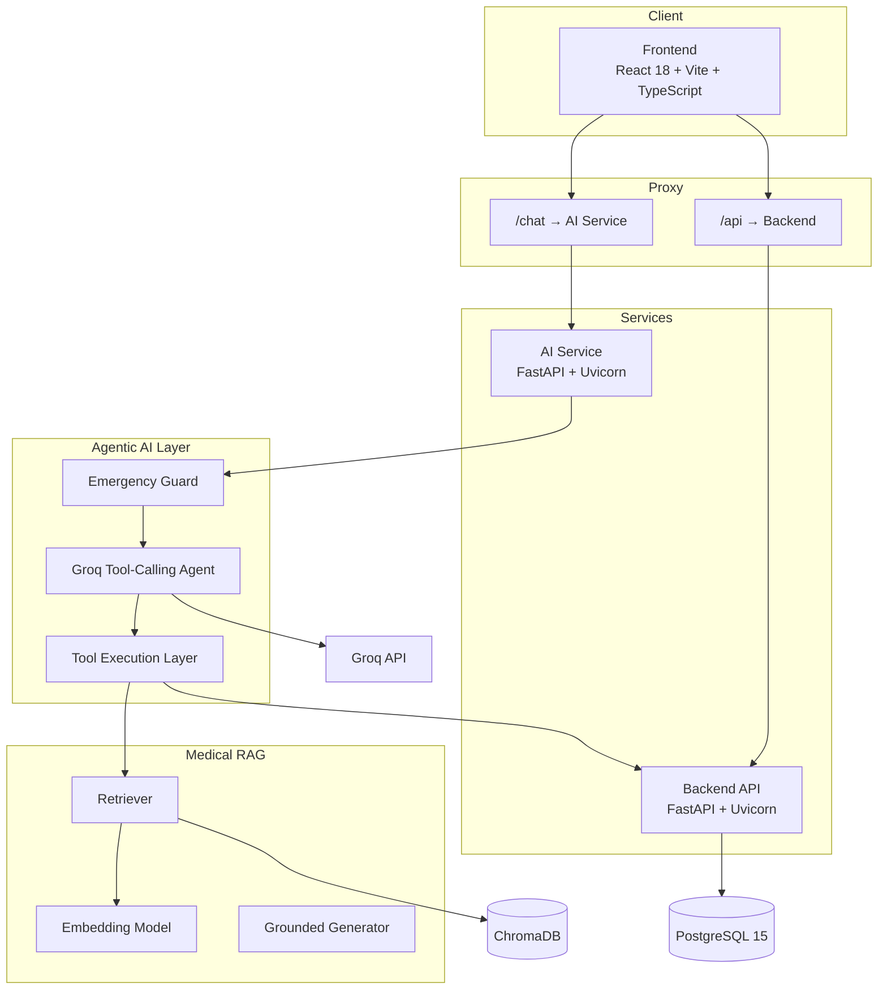

# MediBook AI

**AI-powered virtual receptionist and clinic management platform for small and medium-sized clinics in Pakistan — combining agentic conversational AI, grounded medical RAG, real-time appointment management, and clinic operations in one platform.**

[](https://react.dev/)
[](https://fastapi.tiangolo.com/)
[](https://www.postgresql.org/)
[](https://docs.docker.com/compose/)
[](https://groq.com/)
[](https://www.trychroma.com/)

---

## Three Implementations

MediBook AI is developed as **three complete, independently runnable implementations**, allowing the evolution from a deterministic baseline to grounded medical RAG and finally to an agentic RAG architecture.

| Version | Branch | Description |
|---|---|---|
| **Agentic RAG (this branch) ⭐** | [`main`](https://github.com/Mzaq1559/MEDIBOOK_AI/tree/main) | The latest implementation. A Groq tool-calling agent reasons over the conversation and uses clinic tools for doctor lookup, availability, appointments, and RAG-grounded medical guidance. All write actions use a backend-enforced propose → confirm → execute flow. |
| **RAG-enabled** | [`rag`](https://github.com/Mzaq1559/MEDIBOOK_AI/tree/rag) | Builds on the baseline with a ChromaDB-backed medical RAG layer for grounded symptom triage while retaining the deterministic conversation state machine. |
| **Baseline / Non-RAG** | [`baseline`](https://github.com/Mzaq1559/MEDIBOOK_AI/tree/baseline) | Original clinic platform with deterministic conversation handling and symptom triage, without retrieval or vector search. |

Each branch is independently runnable.

### Architecture Evolution

```text
main
 │
 │  Deterministic conversation
 │  + deterministic triage
 ▼
feature/rag-vector-db
 │
 │  + medical knowledge retrieval
 │  + ChromaDB
 ▼
agentic ⭐
 │
 │  + single reasoning agent
 │  + tool calling
 │  + RAG as a tool
 │  + backend-authoritative validation
 │  + proposal confirmation gate
 ▼
Flexible + Grounded + Safe Clinic AI
```

---

## 📋 Table of Contents

* [Hackathon Context](#-hackathon-context)
* [Project Status](#-project-status)
* [Problem Statement](#-problem-statement)
* [Solution](#-solution)
* [Agentic Architecture](#-agentic-architecture)
* [Tool Inventory](#-tool-inventory)
* [Safety Architecture](#-safety-architecture)
* [System Architecture](#-system-architecture)
* [Tech Stack](#-tech-stack)
* [Key Features](#-key-features)
* [Demo Scenarios](#-demo-scenarios)
* [Getting Started](#-getting-started)
* [RAG Configuration](#-rag-configuration)
* [Knowledge Base](#-knowledge-base)
* [API Documentation](#-api-documentation)
* [Database](#-database)
* [Project Structure](#-project-structure)
* [Testing](#-testing)
* [Observability](#-observability)
* [Security](#-security)
* [Limitations & Future Work](#-limitations--future-work)
* [Team](#-team)
* [License](#-license)

---

# 🏆 Hackathon Context

**Event:** Alibaba Cloud AI Hackathon Pakistan 2026
**Theme:** *AI for Pakistan's Future*
**Build Window:** August 22 – September 4, 2026
**Location:** Taxila, Pakistan
**Team Size:** 4

### Team

| Member                           | Role               | GitHub                                                   |
| -------------------------------- | ------------------ | -------------------------------------------------------- |
| **Muhammad Zulqarnain Abdullah** | Project Lead       | [@Mzaq1559](https://github.com/Mzaq1559)                 |
| **Sidra Pervaiz**                | Backend Developer  | [@SidraPervaiz1122](https://github.com/SidraPervaiz1122) |
| **Aleeza Imran**                 | Frontend Developer | [@BSCS2455](https://github.com/BSCS2455)                 |
| **Ayesha Sajjad**                | AI & Integrations  | [@AyeshaSajjad0786](https://github.com/AyeshaSajjad0786) |

---

# 📊 Project Status

The `agentic` branch represents the current **agentic implementation** of MediBook AI.

Instead of relying on a hardcoded conversation state machine, the chatbot uses a **single Groq tool-calling agent** that reasons over the conversation and dynamically selects the tools required to fulfill a patient's request.

The agent can:

* Search for doctors
* Check doctor availability
* Retrieve patient appointments
* Retrieve grounded medical knowledge
* Propose appointments
* Propose rescheduling
* Propose cancellations
* Execute confirmed actions
* Route patients toward appropriate specialties
* Handle multi-step conversations naturally

The system also maintains strict safety boundaries:

* Emergency detection runs **before the agent**
* The LLM cannot directly write to the database
* Appointment ownership is enforced server-side
* Availability is validated by the backend
* Every write operation requires explicit confirmation
* Confirmations are tied to a unique proposal
* Medical responses can be grounded using the RAG knowledge base

---

# ❗ Problem Statement

Small and medium-sized clinics in Pakistan frequently rely on manual processes for patient communication and appointment management.

Common problems include:

* 📞 Appointment booking through phone calls or WhatsApp
* 📋 Paper-based or fragmented appointment management
* 🔄 Difficulty rescheduling or cancelling appointments
* 👩‍⚕️ Limited visibility into doctor availability
* 🕐 No after-hours receptionist support
* 🔔 Missed appointments and inconsistent reminders
* 🧑‍💼 Receptionist workload caused by repetitive questions
* 🩺 Patients unsure which specialty they should consult
* 🤖 Rigid chatbot flows that fail when users change topics or phrase requests unexpectedly

Traditional scripted chatbots can handle predefined paths, but they struggle with natural conversations.

MediBook AI addresses this by combining:

> **Agentic reasoning + backend-authoritative clinic operations + grounded medical knowledge.**

---

# 💡 Solution

MediBook AI acts as a **24/7 AI virtual receptionist** for clinics.

Patients can communicate naturally with the assistant instead of navigating menus or rigid scripts.

A typical interaction looks like:

```text
Patient
   │
   ▼
Emergency Safety Check
   │
   ├── Emergency → Immediate emergency guidance
   │
   └── Non-emergency
          │
          ▼
   Agentic Reasoning
          │
          ├── Doctor Search
          ├── Availability
          ├── Appointment Lookup
          ├── Medical RAG
          └── Transaction Proposal
                    │
                    ▼
              Backend Validation
                    │
                    ▼
             Patient Confirmation
                    │
                    ▼
              Database Commit
```

### Core Design Principle

```text
Deterministic Emergency Guard
            +
Single Reasoning Agent
            +
Medical RAG
            +
Backend Validation
            +
Explicit Confirmation
            =
Safe + Flexible Clinic AI
```

The LLM determines **what it wants to do**.

The backend determines **what it is actually allowed to do**.

---

# 🤖 Agentic Architecture

The chatbot orchestrator lives in:

```text
ai-service/app/chatbot.py
```

The previous deterministic conversation state machine has been replaced by an agentic tool-calling loop.

### Request Lifecycle

```text
Patient Message
      │
      ▼
┌───────────────────────────────┐
│ Deterministic Emergency Guard │
└───────────────┬───────────────┘
                │
        Emergency?
        ┌───────┴───────┐
        │               │
       YES              NO
        │               │
        ▼               ▼
Emergency Response   Groq Agent
                        │
                        ▼
                  Tool Selection
                        │
              ┌─────────┴─────────┐
              │                   │
           Read Tool          Write Proposal
              │                   │
              │                   ▼
              │             Backend Validation
              │                   │
              │                   ▼
              │             Patient Confirmation
              │                   │
              │                   ▼
              │             Execute Action
              │
              ▼
          Tool Result
              │
              ▼
        Agent Continues
              │
              ▼
      Natural Language Response
```

---

# 🔐 Write Safety: Propose → Validate → Confirm → Execute

The most important transactional safety mechanism is the **two-step write gate**.

For example:

```text
Patient:
"Book me with Dr. Khan tomorrow at 9 AM."

             │
             ▼
Agent calls:
propose_book_appointment(...)
             │
             ▼
Backend validates:
✓ Doctor exists
✓ Slot exists
✓ Doctor is available
✓ No appointment conflict
             │
             ▼
Proposal stored in-memory
(ai-service process, 5-min TTL)
             │
             ▼
Patient receives:
"I can book Dr. Khan for September 1 at 9:00 AM.
Would you like me to confirm this appointment?"
             │
             ▼
Patient:
"Yes"
             │
             ▼
Proposal ID validated
             │
             ▼
Database transaction committed
```

### Important rule

**A proposal never writes to PostgreSQL.**

Only the explicit confirmation step can execute the validated proposal.

This prevents the agent from accidentally booking, cancelling, or rescheduling an appointment simply because the model generated a tool call.

---

# 🛠️ Tool Inventory

## Read-Only Tools

These tools can be called without confirmation.

| Tool                         | Purpose                                           |
| ---------------------------- | ------------------------------------------------- |
| `list_doctors`               | Find doctors, optionally filtered by specialty    |
| `get_doctor_availability`    | Retrieve available appointment slots              |
| `get_patient_appointments`   | Retrieve the authenticated patient's appointments |
| `get_clinic_info`            | Retrieve clinic hours, fees, location, etc.       |
| `retrieve_medical_knowledge` | Retrieve grounded medical information using RAG   |

---

## Write Tools

These tools use the proposal-confirmation mechanism.

| Tool                             | Purpose                                          |
| -------------------------------- | ------------------------------------------------ |
| `propose_book_appointment`       | Validate and propose a new appointment           |
| `propose_reschedule_appointment` | Validate and propose an appointment change       |
| `propose_cancel_appointment`     | Validate and propose an appointment cancellation |
| `execute_confirmed_action`       | Commit an explicitly confirmed proposal          |

---

# 🛡️ Safety Architecture

Safety is enforced as a hierarchy:

```text
1. Deterministic Emergency Detection
              ↓
2. Backend Authorization & Validation
              ↓
3. Explicit Patient Confirmation
              ↓
4. Grounded Medical Retrieval
              ↓
5. LLM Reasoning
```

The LLM is intentionally **not** the final authority.

---

## 🚨 Emergency Detection

Emergency detection runs before the agent loop.

Example:

```text
"I have severe chest pain and I can't breathe."
```

The emergency detector evaluates the message first.

If an emergency condition is detected:

```text
Emergency Guard
      ↓
Emergency Response
      ↓
Agent is NOT invoked
```

This ensures that an LLM response or RAG retrieval cannot delay or downgrade the emergency response.

---

# 🔒 Server-Side Identity & Authorization

The LLM never gets to decide whose data it can access.

For example:

```text
patient_id
doctor_id
appointment_id
```

are resolved or validated server-side.

The model cannot simply invent:

```text
patient_id = 123
appointment_id = 456
```

and expect the backend to trust it.

Appointment ownership is verified by the backend before cancellation or rescheduling.

---

# 🧠 Medical RAG

Medical knowledge retrieval is implemented as an **agent tool**.

`retrieve_medical_knowledge` is registered in `TOOL_DEFINITIONS` in `ai-service/app/tools.py` and handled by `tool_retrieve_medical_knowledge`, which invokes the RAG pipeline's `triage_symptoms` method. The agent can decide when medical knowledge retrieval is useful.

```text
Patient symptom
      │
      ▼
Agent
      │
      ▼
retrieve_medical_knowledge
      │
      ▼
Embedding
      │
      ▼
ChromaDB
      │
      ▼
Relevant Medical Documents
      │
      ▼
Grounded Response
```

RAG is used for:

* Symptom information
* Common conditions
* Specialty guidance
* Emergency indicators
* General medical education
* Clinic procedures

### Important

MediBook AI is **not a diagnostic system**.

It provides informational guidance and triage support rather than definitive medical diagnoses.

---

# 🏗️ System Architecture



---

# 🧰 Tech Stack

| Layer               | Technologies                                                  |
| ------------------- | ------------------------------------------------------------- |
| **Frontend**        | React 18, TypeScript, Vite, Tailwind CSS, React Router, Axios |
| **Backend**         | FastAPI, Uvicorn, SQLAlchemy, Alembic, Pydantic v2, JWT       |
| **AI Service**      | FastAPI, Groq SDK, httpx, agentic orchestration               |
| **LLM**             | Groq API                                                      |
| **Embeddings**      | Sentence Transformers                                         |
| **Vector Database** | ChromaDB                                                      |
| **Database**        | PostgreSQL 15                                                 |
| **Deployment**      | Docker + Docker Compose                                       |
| **Automation**      | n8n                                                           |
| **Calendar**        | Google Calendar                                               |
| **Notifications**   | SMTP email                                                    |

---

# ✨ Key Features

## Agentic AI

* ✅ Single tool-calling AI agent
* ✅ No hardcoded conversation state machine
* ✅ Natural multi-turn conversations
* ✅ Dynamic tool selection
* ✅ Full conversation context
* ✅ Agent-driven clinic operations

## Medical RAG

* ✅ ChromaDB vector database
* ✅ Sentence Transformer embeddings
* ✅ Grounded medical retrieval
* ✅ Structured RAG responses
* ✅ Medical source references
* ✅ Clinic-aware metadata
* ✅ RAG observability metrics

## Appointment Management

* ✅ Doctor search
* ✅ Doctor availability
* ✅ Appointment booking
* ✅ Appointment rescheduling
* ✅ Appointment cancellation
* ✅ Conflict detection
* ✅ Server-side ownership validation
* ✅ Explicit confirmation before writes

## Clinic Management

* ✅ Patient authentication
* ✅ Patient dashboard
* ✅ Doctor dashboard
* ✅ Admin dashboard
* ✅ Prescriptions
* ✅ Google Calendar integration
* ✅ Email reminders
* ✅ n8n automation

## Security

* ✅ JWT authentication
* ✅ Role-based authorization
* ✅ Deterministic emergency detection
* ✅ Server-side ID resolution
* ✅ Backend-authoritative validation
* ✅ Proposal locking
* ✅ No direct LLM database writes
* ✅ PHI-conscious logging

---

# 🎬 Demo Scenarios

## 1. Natural Appointment Booking

```text
Book me an appointment with a cardiologist
next Tuesday afternoon.
```

The agent can:

1. Identify the specialty
2. Find appropriate doctors
3. Check availability
4. Select an available slot
5. Create a proposal
6. Ask for confirmation
7. Execute only after confirmation

---

## 2. Medical RAG

```text
I've had a sore throat and cough for two days.
```

The agent can invoke:

```text
retrieve_medical_knowledge
```

and use the retrieved information to provide grounded guidance and potentially route the patient toward an appropriate specialty.

---

## 3. Emergency Detection

```text
I have severe chest pain and I cannot breathe properly.
```

The deterministic emergency guard runs first.

```text
Emergency detected
       ↓
Immediate emergency guidance
       ↓
Agent not invoked
```

---

## 4. Appointment Cancellation

```text
Cancel my appointment with Dr. Khan.
```

The agent retrieves the patient's actual appointments, identifies the correct appointment, validates ownership, proposes the cancellation, and waits for explicit confirmation.

---

## 5. Off-Topic Messages

During an appointment flow, a patient can send an unrelated or hostile message.

The agent can redirect the conversation without unnecessarily destroying the existing conversation context or pending proposal.

---

# 🚀 Getting Started

## Prerequisites

Install:

* Docker
* Docker Compose v2+
* Git
* Groq API key

---

## 1. Clone Repository

```bash
git clone https://github.com/Mzaq1559/MEDIBOOK_AI.git
cd MEDIBOOK_AI
git checkout agentic
```

---

## 2. Configure Environment

```bash
cp .env.example .env
```

Set the required variables:

```env
GROQ_API_KEY=your-groq-api-key
GROQ_MODEL=openai/gpt-oss-120b
```

---

## 3. Build and Start

```bash
docker compose build
docker compose up -d
```

### Services

| Service    |   Port |
| ---------- | -----: |
| Frontend   | `3000` |
| Backend    | `8000` |
| AI Service | `8001` |
| PostgreSQL | `5432` |
| n8n        | `5678` |

---

## 4. Verify Services

```bash
curl http://localhost:8000/health
curl http://localhost:8001/health
curl http://localhost:8001/api/rag/health
```

---

## 5. Seed Credentials

The database is automatically seeded on first start. Use these accounts to log in:

### 🩺 Patients

| Email | Password | Name |
| --- | --- | --- |
| `ali.khan@example.com` | `PatientPass123!` | Ali Khan |
| `sara.ahmed@example.com` | `PatientPass123!` | Sara Ahmed |
| `usman.raza@example.com` | `PatientPass123!` | Usman Raza |

### 👨‍⚕️ Doctors

| Email | Password | Name | Specialization |
| --- | --- | --- | --- |
| `ahmed.khan@primecare.pk` | `PatientPass123!` | Dr. Ahmed Khan | Cardiology |
| `fatima.zahra@primecare.pk` | `PatientPass123!` | Dr. Fatima Zahra | Dermatology |
| `tariq.mahmood@cityhealth.pk` | `PatientPass123!` | Dr. Tariq Mahmood | General Medicine |

### 🔑 Admin

| Email | Password |
| --- | --- |
| `admin@medibook.com` | `Admin@123` |

---

# 🧠 RAG Configuration

RAG is controlled through environment variables.

```env
RAG_ENABLED=true
RAG_VECTOR_DB_PATH=/app/data/chroma
RAG_COLLECTION_NAME=medical_knowledge
RAG_EMBEDDING_MODEL=sentence-transformers/all-MiniLM-L6-v2
RAG_TOP_K=5
RAG_MIN_RELEVANCE_SCORE=0.35
RAG_CACHE_ENABLED=true
```

When enabled, the agent receives:

```text
retrieve_medical_knowledge
```

as one of its available tools.

If RAG is disabled, appointment-related agent functionality remains available because clinic operations and medical retrieval are implemented as separate tools.

---

# 📚 Knowledge Base

The medical knowledge base is maintained under:

```text
ai-service/app/knowledge_base/
```

It contains structured information covering:

* Symptoms
* Common conditions
* Medical specialties
* Emergency indicators
* Clinic procedures

ChromaDB is used exclusively for medical knowledge retrieval.

**Appointment, identity, and transactional data remain in PostgreSQL.**

---

# 📡 API Documentation

Once the system is running:

| Service            | URL                                    |
| ------------------ | -------------------------------------- |
| Backend Swagger    | `http://localhost:8000/docs`           |
| Backend ReDoc      | `http://localhost:8000/redoc`          |
| AI Service Swagger | `http://localhost:8001/docs`           |
| RAG Health         | `http://localhost:8001/api/rag/health` |

---

# 🗄️ Database

PostgreSQL is the authoritative source of truth for:

* Users
* Clinics
* Doctors
* Patients
* Appointments
* Doctor schedules
* Clinic holidays
* Prescriptions
* Audit information

ChromaDB is **not** used for transactional or identity data.

---

# 📁 Project Structure

```text
MEDIBOOK_AI/
│
├── backend/
│   └── # FastAPI backend + PostgreSQL operations
│
├── frontend/
│   └── # React frontend
│
├── ai-service/
│   ├── app/
│   │   ├── chatbot.py
│   │   ├── chatbot_handlers.py
│   │   ├── chatbot_nlu.py
│   │   ├── groq_client.py
│   │   ├── backend_client.py
│   │   │
│   │   ├── rag/
│   │   │   ├── config.py
│   │   │   ├── models.py
│   │   │   ├── vector_db.py
│   │   │   ├── embeddings.py
│   │   │   ├── retriever.py
│   │   │   ├── augmentation.py
│   │   │   ├── generator.py
│   │   │   ├── pipeline.py
│   │   │   ├── safety.py
│   │   │   ├── cache.py
│   │   │   ├── knowledge_loader.py
│   │   │   └── metrics.py
│   │   │
│   │   └── knowledge_base/
│   │
│   ├── data/
│   │   └── chroma/
│   │
│   └── tests/
│       ├── test_agent_rag_system.py
│       ├── test_chatbot_patient_id.py
│       ├── test_rag_retriever.py
│       ├── test_rag_pipeline.py
│       ├── test_rag_safety.py
│       └── test_rag_integration.py
│
├── docker-compose.yml
├── .env.example
└── README.md
```

---

# 🧪 Testing

## Backend

```bash
docker compose exec backend pytest -v
```

## AI Service

```bash
docker compose exec ai-service pytest -v
```

### Agent & Safety Tests

The agent test suite covers:

1. Emergency detection bypasses the agent
2. Booking requests do not accidentally trigger symptom intake
3. Duplicate requests do not create duplicate actions
4. Proposals do not write to the database
5. Writes require explicit confirmation
6. Unavailable slots are rejected
7. Appointment conflicts are rejected
8. Appointment ownership is enforced
9. Stale proposals cannot be executed
10. Off-topic messages preserve appropriate session context
11. Symptom queries can invoke RAG
12. Patient IDs are resolved server-side

Existing RAG tests cover:

* Retrieval
* Pipeline behavior
* Safety
* Integration
* Knowledge loading

---

# 📈 Observability

The AI service exposes metrics for both RAG and agent behavior.

Examples include:

```text
rag_requests_total
rag_retrievals_total
rag_generation_total

agent_tool_calls_total
agent_proposals_created_total
agent_proposals_executed_total
agent_fallback_total
```

Logging is designed to avoid unnecessarily recording complete patient conversations or sensitive health information.

---

# 🔐 Security Principles

MediBook AI follows several strict security principles:

### 1. The LLM is not trusted with authorization

The backend validates all sensitive operations.

### 2. The LLM cannot directly modify PostgreSQL

Database writes occur only through the controlled execution path.

### 3. Patient ownership is server-side

A model-generated request cannot bypass appointment ownership rules.

### 4. Proposals are locked

Every transactional proposal receives a unique identifier.

A confirmation must correspond to the active proposal.

### 5. RAG does not contain transactional data

Medical knowledge and clinic transaction data are kept separate.

### 6. Emergency detection is deterministic

Emergency handling does not depend on whether the LLM chooses to invoke a tool.

---

# ⚠️ Limitations & Future Work

## Current Limitations

* **Web-first:** Native mobile applications are not currently included.
* **English-primary:** Urdu/English bilingual support is planned.
* **Session persistence:** Conversational sessions are held in-memory within each ai-service process. Restarting the ai-service container clears all active sessions.
* **In-memory proposal storage:** Write-gate proposals (`_PROPOSALS` in `tools.py`) are also stored in-memory. Any pending proposal (book, reschedule, or cancel) is lost if the ai-service process restarts before the patient confirms. Patients would need to restart the booking flow after a service restart.
* **Medical scope:** RAG focuses on common symptoms, conditions, specialties, emergency indicators, and clinic procedures.
* **Informational medical guidance:** The system is not intended to diagnose patients.

## Future Improvements

1. Persist conversations and pending proposals using PostgreSQL or Redis.
2. Expand and clinically review the medical knowledge base.
3. Add Urdu/English bilingual conversations and retrieval.
4. Introduce hybrid lexical + vector retrieval.
5. Integrate WhatsApp Business API.
6. Expand n8n automation workflows.
7. Add advanced agent observability and evaluation.
8. Develop native mobile applications.

---

# 👥 Team

Built by a four-person team for the **Alibaba Cloud AI Hackathon Pakistan 2026**.

| Name                             | Role               | Contributions                                                                                                   |
| -------------------------------- | ------------------ | --------------------------------------------------------------------------------------------------------------- |
| **Muhammad Zulqarnain Abdullah** | Project Lead       | Architecture, Docker, seeding, chat integration, RAG integration, agentic architecture, repository coordination |
| **Sidra Pervaiz**                | Backend Developer  | FastAPI backend, database models, appointment engine, authorization, backend tests                              |
| **Aleeza Imran**                 | Frontend Developer | React UI, design system, page layouts, chat interface                                                           |
| **Ayesha Sajjad**                | AI & Integrations  | AI microservice, Groq integration, NLU, symptom triage, conversational AI, integrations                         |

---

# 📄 License

No open-source license file is currently included in this repository.

This project is submitted for **Alibaba Cloud AI Hackathon Pakistan 2026** evaluation purposes.

---

## ⭐ MediBook AI

> **The agent proposes.
> The backend validates.
> The patient confirms.
> The system executes.**
