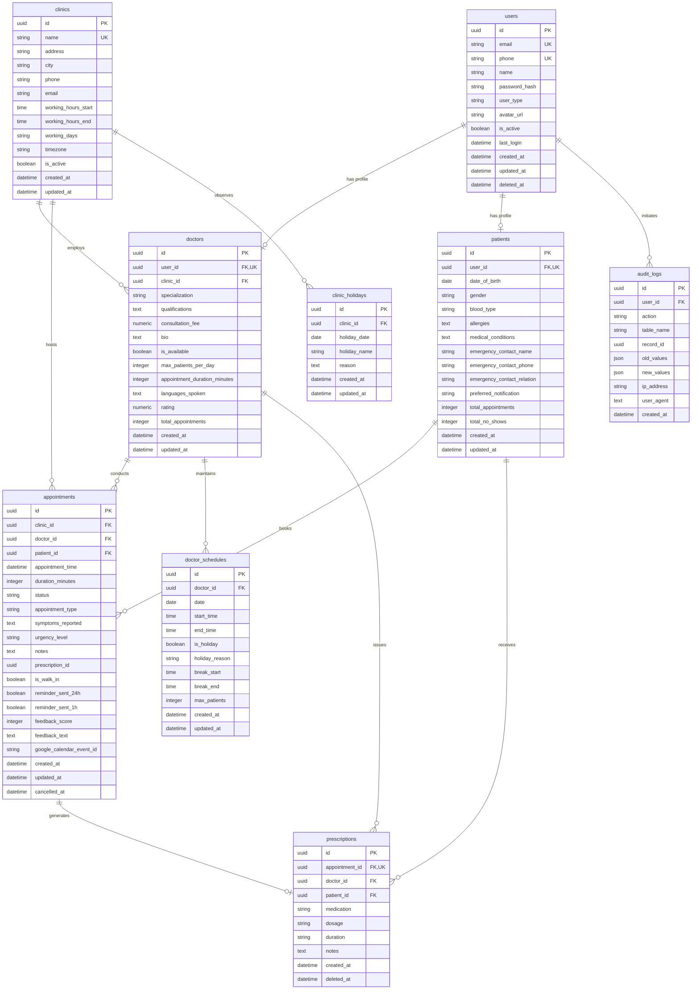

# MediBook AI Database Schema

This document details the database architecture, table definitions, relationships, indexes, and data separation model for the MediBook AI platform.

---

## 1. Architecture & Data Separation

MediBook AI enforces strict data separation between transactional data and vector search data:

```
┌────────────────────────────────────────────────────────┐
│                   Data Separation                      │
├───────────────────────────┬────────────────────────────┤
│  PostgreSQL 15 (Port 5432)│  ChromaDB (In-Process)     │
│  Sole Transactional Truth │  Isolated Medical Embeddings│
├───────────────────────────┼────────────────────────────┤
│ • Users & Authentication  │ • Clinical triage chunks   │
│ • Clinics & Holidays      │ • Specialty guidelines     │
│ • Doctor Profiles & Slots │ • Symptom classifications  │
│ • Patient Profiles & PII  │ • Emergency indicators     │
│ • Appointments & Status   │                            │
│ • Prescriptions           │ ❌ NEVER stores user PII    │
│ • Audit Logs              │ ❌ NEVER stores appointments│
└───────────────────────────┴────────────────────────────┘
```

- **PostgreSQL 15**: Primary relational database running in container `medibook_postgres`. Managed via SQLAlchemy 2.x models and Alembic migrations (`alembic upgrade head` executes on backend container startup).
- **ChromaDB**: In-process vector store inside the AI Service container (`/app/data/chroma`). Holds chunked medical triage knowledge embedded via `all-MiniLM-L6-v2`. It does **not** store transactional state, credentials, or appointment records.

---

## 2. Entity-Relationship Diagram



---

## 3. Table Definitions

### 3.1 `users`
Core user identity and authentication table.
- Primary Key: `id` (UUID)
- Model: `backend/app/models/user.py`

| Column | Type | Nullable | Default | Description |
|---|---|---|---|---|
| `id` | UUID | No | `uuid4()` | Primary key |
| `email` | VARCHAR(255) | No | — | Unique login email (indexed) |
| `phone` | VARCHAR(15) | Yes | NULL | Unique phone number |
| `name` | VARCHAR(255) | No | — | Full name |
| `password_hash` | VARCHAR(255) | No | — | bcrypt hashed password |
| `user_type` | VARCHAR(50) | No | — | Role: `patient`, `doctor`, `receptionist`, `admin` (indexed) |
| `avatar_url` | VARCHAR(500) | Yes | NULL | Profile image URL |
| `is_active` | BOOLEAN | No | `TRUE` | Account active flag |
| `last_login` | TIMESTAMP | Yes | NULL | Last successful login timestamp |
| `created_at` | TIMESTAMP | No | `utcnow()` | Creation timestamp (indexed) |
| `updated_at` | TIMESTAMP | No | `utcnow()` | Auto-updating modification timestamp |
| `deleted_at` | TIMESTAMP | Yes | NULL | Soft-deletion timestamp |

---

### 3.2 `clinics`
Registered medical facilities and their operating configurations.
- Primary Key: `id` (UUID)
- Model: `backend/app/models/clinic.py`

| Column | Type | Nullable | Default | Description |
|---|---|---|---|---|
| `id` | UUID | No | `uuid4()` | Primary key |
| `name` | VARCHAR(255) | No | — | Unique clinic name |
| `address` | VARCHAR(500) | No | — | Street address |
| `city` | VARCHAR(100) | No | — | City name (indexed) |
| `phone` | VARCHAR(15) | No | — | Primary contact number |
| `email` | VARCHAR(255) | No | — | Official clinic email |
| `working_hours_start` | TIME | No | `09:00:00` | Clinic opening time |
| `working_hours_end` | TIME | No | `17:00:00` | Clinic closing time |
| `working_days` | VARCHAR(50) | No | `'Mon,Tue,Wed,Thu,Fri'` | Comma-separated active days |
| `timezone` | VARCHAR(50) | No | `'Asia/Karachi'` | Local timezone |
| `is_active` | BOOLEAN | No | `TRUE` | Clinic operational status (indexed) |
| `created_at` | TIMESTAMP | No | `utcnow()` | Record creation timestamp |
| `updated_at` | TIMESTAMP | No | `utcnow()` | Record update timestamp |

---

### 3.3 `doctors`
Professional doctor profiles linked 1:1 to `users`.
- Primary Key: `id` (UUID)
- Model: `backend/app/models/doctor.py`

| Column | Type | Nullable | Default | Description |
|---|---|---|---|---|
| `id` | UUID | No | `uuid4()` | Primary key |
| `user_id` | UUID | No | — | FK → `users.id` (UNIQUE, ON DELETE CASCADE) |
| `clinic_id` | UUID | No | — | FK → `clinics.id` (ON DELETE CASCADE, indexed) |
| `specialization` | VARCHAR(100) | No | — | Medical specialty (e.g. Cardiologist, indexed) |
| `qualifications` | TEXT | No | `'["MBBS"]'` | JSON string of qualifications |
| `consultation_fee` | NUMERIC(10,2) | No | `2000.00` | Consultation fee in PKR |
| `bio` | TEXT | Yes | NULL | Professional biography |
| `is_available` | BOOLEAN | No | `TRUE` | Current availability flag (indexed) |
| `max_patients_per_day`| INTEGER | No | `20` | Daily booking ceiling |
| `appointment_duration_minutes` | INTEGER | No | `30` | Slot duration in minutes |
| `languages_spoken` | TEXT | No | `'["Urdu", "English"]'` | JSON string of languages |
| `rating` | NUMERIC(3,2) | No | `0.0` | Average patient review score |
| `total_appointments`| INTEGER | No | `0` | Lifetime appointment count |
| `created_at` | TIMESTAMP | No | `utcnow()` | Profile creation timestamp |
| `updated_at` | TIMESTAMP | No | `utcnow()` | Profile update timestamp |

**Compound Indexes:**
- `idx_doctor_clinic_available` on `(clinic_id, is_available)`

---

### 3.4 `patients`
Patient medical profiles linked 1:1 to `users`.
- Primary Key: `id` (UUID)
- Model: `backend/app/models/patient.py`

| Column | Type | Nullable | Default | Description |
|---|---|---|---|---|
| `id` | UUID | No | `uuid4()` | Primary key |
| `user_id` | UUID | No | — | FK → `users.id` (UNIQUE, ON DELETE CASCADE) |
| `date_of_birth` | DATE | No | `'1990-01-01'` | Date of birth |
| `gender` | VARCHAR(10) | No | `'M'` | Gender: `'M'`, `'F'`, `'Other'` |
| `blood_type` | VARCHAR(5) | Yes | NULL | Blood group (e.g. `O+`, `B+`) |
| `allergies` | TEXT | Yes | `'[]'` | JSON array of known allergies |
| `medical_conditions`| TEXT | Yes | `'[]'` | JSON array of chronic conditions |
| `emergency_contact_name` | VARCHAR(255) | No | `'Emergency Contact'` | Emergency contact name |
| `emergency_contact_phone`| VARCHAR(15) | No | `'03000000000'` | Emergency contact phone |
| `emergency_contact_relation`| VARCHAR(50)| Yes | NULL | Relationship (e.g. Spouse) |
| `preferred_notification` | VARCHAR(20) | No | `'whatsapp'` | Channel: `whatsapp`, `email`, `sms` (indexed) |
| `total_appointments`| INTEGER | No | `0` | Total booked appointments |
| `total_no_shows` | INTEGER | No | `0` | Total missed appointments |
| `created_at` | TIMESTAMP | No | `utcnow()` | Registration timestamp |
| `updated_at` | TIMESTAMP | No | `utcnow()` | Record update timestamp |

---

### 3.5 `appointments`
Core appointment transactions and status state machine.
- Primary Key: `id` (UUID)
- Model: `backend/app/models/appointment.py`

| Column | Type | Nullable | Default | Description |
|---|---|---|---|---|
| `id` | UUID | No | `uuid4()` | Primary key |
| `clinic_id` | UUID | No | — | FK → `clinics.id` (ON DELETE CASCADE, indexed) |
| `doctor_id` | UUID | No | — | FK → `doctors.id` (ON DELETE CASCADE, indexed) |
| `patient_id` | UUID | No | — | FK → `patients.id` (ON DELETE CASCADE, indexed) |
| `appointment_time` | TIMESTAMP | No | — | Booking datetime (Asia/Karachi, indexed) |
| `duration_minutes` | INTEGER | No | `30` | Consultation length |
| `status` | VARCHAR(20) | No | `'scheduled'` | FSM status: `scheduled`, `confirmed`, `completed`, `cancelled`, `no_show`, `rescheduled` |
| `appointment_type` | VARCHAR(20) | No | `'in_person'` | Type: `in_person`, `video`, `phone` |
| `symptoms_reported`| TEXT | No | — | Patient-described symptoms |
| `urgency_level` | VARCHAR(20) | No | — | Urgency: `low`, `normal`, `high`, `critical` |
| `notes` | TEXT | Yes | NULL | Internal doctor or receptionist notes |
| `prescription_id` | UUID | Yes | NULL | Reference to issued prescription |
| `is_walk_in` | BOOLEAN | No | `FALSE` | Flag for walk-in patients |
| `reminder_sent_24h`| BOOLEAN | No | `FALSE` | 24-hour reminder dispatched flag |
| `reminder_sent_1h` | BOOLEAN | No | `FALSE` | 1-hour reminder dispatched flag |
| `feedback_score` | INTEGER | Yes | NULL | Patient rating (1 to 5) |
| `feedback_text` | TEXT | Yes | NULL | Patient feedback comments |
| `google_calendar_event_id` | VARCHAR(500) | Yes | NULL | Synced Google Calendar event ID |
| `created_at` | TIMESTAMP | No | `utcnow()` | Creation timestamp |
| `updated_at` | TIMESTAMP | No | `utcnow()` | Update timestamp |
| `cancelled_at` | TIMESTAMP | Yes | NULL | Cancellation timestamp |

**Compound Indexes:**
- `idx_appt_doc_time` on `(doctor_id, appointment_time)`
- `idx_appt_clinic_time` on `(clinic_id, appointment_time)`
- `idx_appt_pat_status` on `(patient_id, status)`

---

### 3.6 `doctor_schedules`
Doctor-specific schedule exceptions, holidays, and break periods for specific calendar dates.
- Primary Key: `id` (UUID)
- Model: `backend/app/models/doctor_schedule.py`

| Column | Type | Nullable | Default | Description |
|---|---|---|---|---|
| `id` | UUID | No | `uuid4()` | Primary key |
| `doctor_id` | UUID | No | — | FK → `doctors.id` (ON DELETE CASCADE, indexed) |
| `date` | DATE | No | — | Date of override |
| `start_time` | TIME | Yes | NULL | Customized shift start |
| `end_time` | TIME | Yes | NULL | Customized shift end |
| `is_holiday` | BOOLEAN | No | `FALSE` | Marked as doctor's day off |
| `holiday_reason` | VARCHAR(255) | Yes | NULL | Reason for absence |
| `break_start` | TIME | Yes | NULL | Mid-shift break start (e.g. lunch) |
| `break_end` | TIME | Yes | NULL | Mid-shift break end |
| `max_patients` | INTEGER | Yes | NULL | Custom patient cap for the date |
| `created_at` | TIMESTAMP | No | `utcnow()` | Record creation timestamp |
| `updated_at` | TIMESTAMP | No | `utcnow()` | Record update timestamp |

**Unique Constraints:**
- `uq_doctor_schedule_date` on `(doctor_id, date)`

---

### 3.7 `clinic_holidays`
Clinic-wide closures and public holidays.
- Primary Key: `id` (UUID)
- Model: `backend/app/models/clinic_holiday.py`

| Column | Type | Nullable | Default | Description |
|---|---|---|---|---|
| `id` | UUID | No | `uuid4()` | Primary key |
| `clinic_id` | UUID | No | — | FK → `clinics.id` (ON DELETE CASCADE, indexed) |
| `holiday_date` | DATE | No | — | Calendar date of closure |
| `holiday_name` | VARCHAR(255) | No | — | Holiday name (e.g. Eid-ul-Fitr) |
| `reason` | TEXT | Yes | NULL | Closure description or notice |
| `created_at` | TIMESTAMP | No | `utcnow()` | Record creation timestamp |
| `updated_at` | TIMESTAMP | No | `utcnow()` | Record update timestamp |

**Unique Constraints:**
- `uq_clinic_holiday_date` on `(clinic_id, holiday_date)`

---

### 3.8 `prescriptions`
Medical prescriptions issued by doctors for completed appointments.
- Primary Key: `id` (UUID)
- Model: `backend/app/models/prescription.py`

| Column | Type | Nullable | Default | Description |
|---|---|---|---|---|
| `id` | UUID | No | `uuid4()` | Primary key |
| `appointment_id` | UUID | No | — | FK → `appointments.id` (UNIQUE, ON DELETE CASCADE) |
| `doctor_id` | UUID | No | — | FK → `doctors.id` (ON DELETE CASCADE) |
| `patient_id` | UUID | No | — | FK → `patients.id` (ON DELETE CASCADE) |
| `medication` | VARCHAR | No | — | Prescribed drug name |
| `dosage` | VARCHAR | No | — | Dosage specification (e.g. `500mg`) |
| `duration` | VARCHAR | No | — | Treatment duration (e.g. `7 days`) |
| `notes` | TEXT | Yes | NULL | Instructions (e.g. `Take after meals`) |
| `created_at` | TIMESTAMP | No | `utcnow()` | Issue timestamp |
| `deleted_at` | TIMESTAMP | Yes | NULL | Soft delete timestamp |

---

### 3.9 `audit_logs`
System-wide audit trail recording state mutations and sensitive operations.
- Primary Key: `id` (UUID)
- Model: `backend/app/models/audit_log.py`

| Column | Type | Nullable | Default | Description |
|---|---|---|---|---|
| `id` | UUID | No | `uuid4()` | Primary key |
| `user_id` | UUID | Yes | NULL | FK → `users.id` (ON DELETE SET NULL, indexed) |
| `action` | VARCHAR(255) | No | — | Action name: `CREATE`, `UPDATE`, `DELETE`, etc. (indexed) |
| `table_name` | VARCHAR(100) | No | — | Target table name |
| `record_id` | UUID | No | — | Affected record UUID |
| `old_values` | JSON | Yes | NULL | JSON snapshot prior to mutation |
| `new_values` | JSON | Yes | NULL | JSON snapshot after mutation |
| `ip_address` | VARCHAR(50) | Yes | NULL | Client IP address |
| `user_agent` | TEXT | Yes | NULL | Client browser/HTTP agent string |
| `created_at` | TIMESTAMP | No | `utcnow()` | Timestamp of action (indexed) |

---

## 4. Appointment Status State Machine

```
              ┌───────────────┐
              │   SCHEDULED   │
              └───┬───────┬───┘
                  │       │
       ┌──────────┘       └──────────┐
       ▼                             ▼
┌──────────────┐              ┌──────────────┐
│  CANCELLED   │              │  CONFIRMED   │
└──────────────┘              └───┬───────┬───┘
                                  │       │
                       ┌──────────┘       └──────────┐
                       ▼                             ▼
                ┌──────────────┐              ┌──────────────┐
                │  COMPLETED   │              │   NO_SHOW    │
                └──────────────┘              └──────────────┘
```

- **`scheduled`**: Initial state upon booking creation via the AI agent or dashboard.
- **`confirmed`**: Verified by clinic staff or patient check-in.
- **`completed`**: Appointment successfully conducted; doctor can now issue a `prescription`.
- **`cancelled`**: Cancelled by patient or doctor before consultation.
- **`no_show`**: Patient failed to attend; only settable after appointment datetime has passed.
- **`rescheduled`**: Slot moved to a new time; previous record updated.
