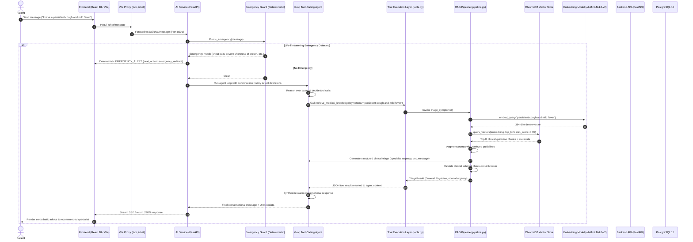

# MediBook AI — Medical RAG Architecture

MediBook AI integrates a Retrieval-Augmented Generation (RAG) pipeline encapsulated as an autonomous agent tool (`retrieve_medical_knowledge`). The agent dynamically invokes this tool when a patient describes symptoms, inquires about health conditions, or seeks clinical specialty recommendations.

---

## 1. Architectural Role in the Agentic System

In the current `main` branch architecture, there is no deterministic conversation state machine. Instead:
- **Emergency Guard**: Runs synchronously before any LLM execution to catch life-threatening conditions.
- **Groq Tool-Calling Agent**: If no emergency is detected, the agent reasons over the conversation and selects tools from `TOOL_DEFINITIONS`.
- **Medical RAG Tool**: When medical grounding is required, the agent calls `retrieve_medical_knowledge(symptoms=...)`.
- **RAG Pipeline**: Retrieves clinical guidelines from ChromaDB, augments the prompt, generates structured clinical recommendations with Groq, validates clinical safety, and returns structured triage data back to the agent loop.

---

## 2. End-to-End System Architecture Diagram



---

## 3. RAG Subsystem Components

All RAG modules reside in `ai-service/app/rag/`:

| Module | Responsibility |
|---|---|
| [`config.py`](file:///home/monster/Desktop/Coding/Projects/MEDIBOOK_AI/ai-service/app/rag/config.py) | Configuration via `rag_settings` (`RAG_ENABLED`, `RAG_TOP_K`, `RAG_MIN_RELEVANCE_SCORE`, etc.) |
| [`models.py`](file:///home/monster/Desktop/Coding/Projects/MEDIBOOK_AI/ai-service/app/rag/models.py) | Pydantic schemas: `KnowledgeDocument`, `RetrievalResult`, `TriageResult`, and `RAGMetricsSnapshot` |
| [`vector_db.py`](file:///home/monster/Desktop/Coding/Projects/MEDIBOOK_AI/ai-service/app/rag/vector_db.py) | Persistent ChromaDB client (`/app/data/chroma`), collection lifecycle, cosine distance search |
| [`embeddings.py`](file:///home/monster/Desktop/Coding/Projects/MEDIBOOK_AI/ai-service/app/rag/embeddings.py) | `sentence-transformers` (`all-MiniLM-L6-v2`) 384-dimensional dense vector embeddings |
| [`retriever.py`](file:///home/monster/Desktop/Coding/Projects/MEDIBOOK_AI/ai-service/app/rag/retriever.py) | Semantic top-K retrieval, relevance score thresholding, and optional clinic-specific metadata filtering |
| [`augmentation.py`](file:///home/monster/Desktop/Coding/Projects/MEDIBOOK_AI/ai-service/app/rag/augmentation.py) | Grounded prompt construction embedding retrieved clinical passages and strict guidance boundaries |
| [`generator.py`](file:///home/monster/Desktop/Coding/Projects/MEDIBOOK_AI/ai-service/app/rag/generator.py) | Groq LLM inference with JSON mode enforcement to produce validated `TriageResult` objects |
| [`safety.py`](file:///home/monster/Desktop/Coding/Projects/MEDIBOOK_AI/ai-service/app/rag/safety.py) | Post-generation safety validation: emergency keyword double-check, mandatory disclaimers, fallback mapping |
| [`circuit_breaker.py`](file:///home/monster/Desktop/Coding/Projects/MEDIBOOK_AI/ai-service/app/rag/circuit_breaker.py) | Circuit breaker pattern (`CLOSED`, `OPEN`, `HALF-OPEN`) protecting against repeated vector DB or LLM failures |
| [`cache.py`](file:///home/monster/Desktop/Coding/Projects/MEDIBOOK_AI/ai-service/app/rag/cache.py) | In-memory query caching to avoid redundant embeddings and vector searches for common symptom descriptions |
| [`knowledge_loader.py`](file:///home/monster/Desktop/Coding/Projects/MEDIBOOK_AI/ai-service/app/rag/knowledge_loader.py) | Ingestion script parsing JSON files in `app/knowledge_base/` and indexing chunked vectors into ChromaDB |
| [`metrics.py`](file:///home/monster/Desktop/Coding/Projects/MEDIBOOK_AI/ai-service/app/rag/metrics.py) | Thread-safe performance counters tracking queries, cache hits, fallbacks, tool invocations, and latencies |
| [`pipeline.py`](file:///home/monster/Desktop/Coding/Projects/MEDIBOOK_AI/ai-service/app/rag/pipeline.py) | Central orchestrator coordinating retrieval, generation, safety checks, circuit breaker, and audit logging |

---

## 4. Multi-Layer Safety Hierarchy

MediBook AI protects patients through four distinct defense layers:

```
┌─────────────────────────────────────────────────────────────┐
│ 1. Deterministic Emergency Guard (symptom_triage.py)        │
│    • Regex pattern matching in English & Roman Urdu        │
│    • Executes BEFORE the LLM agent is ever invoked          │
│    • Completely unbypassable by LLM hallucinations         │
└──────────────────────────────┬──────────────────────────────┘
                               │ Clear
┌──────────────────────────────▼──────────────────────────────┐
│ 2. Server-Side Identity & Write Gate (tools.py)              │
│    • Strict Propose → Validate → Confirm → Execute flow     │
│    • 5-minute in-memory proposal TTL with UUID matching     │
│    • LLM cannot write directly to PostgreSQL                │
└──────────────────────────────┬──────────────────────────────┘
                               │ Medical Triage Tool Called
┌──────────────────────────────▼──────────────────────────────┐
│ 3. Clinical RAG Grounding & Safety Validation (safety.py)   │
│    • Knowledge retrieved strictly from verified guidelines   │
│    • Secondary post-generation emergency keyword check      │
│    • Automatic urgency escalation if red flags are detected │
│    • Circuit breaker fallback to rule-based triage on failure│
└──────────────────────────────┬──────────────────────────────┘
                               │ Grounded Context Returned
┌──────────────────────────────▼──────────────────────────────┐
│ 4. Groq Tool-Calling Agent Loop (chatbot.py)                │
│    • Synthesizes warm, professional 1-2 sentence advice      │
│    • Does not diagnose; recommends clinical specialty       │
└─────────────────────────────────────────────────────────────┘
```

---

## 5. Knowledge Base Structure

The knowledge base is version-controlled under `ai-service/app/knowledge_base/` in structured JSON files:
- `cardiology.json`: Chest pain, palpitations, hypertension guidelines.
- `dermatology.json`: Rashes, lesions, skin allergies.
- `ent.json`: Ear pain, sinusitis, sore throat.
- `general_physician.json`: Fevers, fatigue, flu-like symptoms.
- `neurology.json`: Headaches, migraines, dizziness.
- `orthopedics.json`: Joint pain, fractures, sprains.
- `pediatrics.json`: Childhood fevers, coughs, rashes.
- `emergency.json`: Critical symptoms requiring immediate emergency department referral.
- `clinic_procedures.json`: Clinic policies, appointment prep, and check-in workflows.

**Clinic-Specific Scoping:**
Documents with `clinic_id: null` apply globally across all clinics. Documents stamped with a specific clinic UUID are returned only when querying on behalf of that clinic.

---

## 6. Circuit Breaker & Fallback Resilience

If ChromaDB is unavailable, embedding generation fails, or the Groq API times out:
1. The **Circuit Breaker** records the error. If consecutive failures exceed `CIRCUIT_BREAKER_FAILURE_THRESHOLD` (default: 3), the circuit transitions to `OPEN` for `CIRCUIT_BREAKER_RECOVERY_TIMEOUT_SEC` (default: 30s).
2. The pipeline triggers a graceful fallback to deterministic triage (`app/symptom_triage.py`).
3. The chatbot agent remains 100% operational, advising the patient safely without crashing or exposing stack traces.

---

## 7. Performance & Latency Observability

Every execution of `retrieve_medical_knowledge` logs a detailed microsecond-level performance breakdown:
- `embed_ms`: Time taken by `sentence-transformers` to generate query embeddings.
- `vector_db_ms`: ChromaDB cosine similarity search latency.
- `groq_gen_ms`: Groq LLM generation latency.
- Metrics are exported via `GET /api/rag/health` and tracked in `app/rag/metrics.py`.
